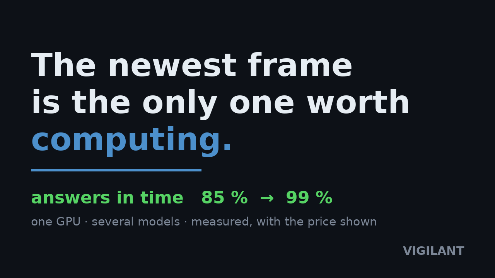
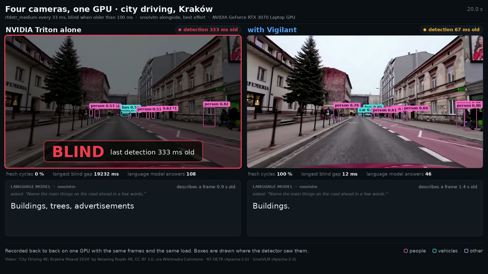
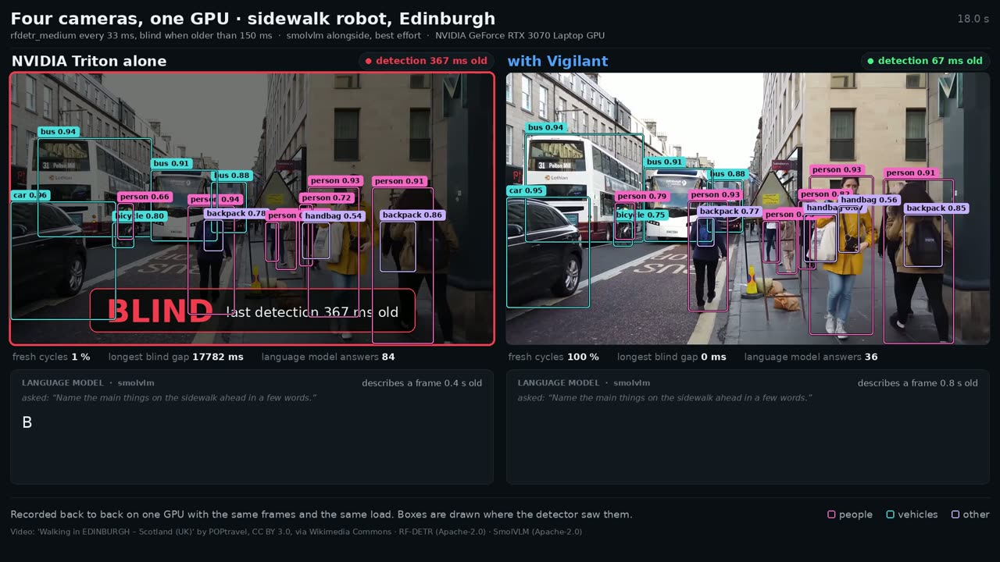
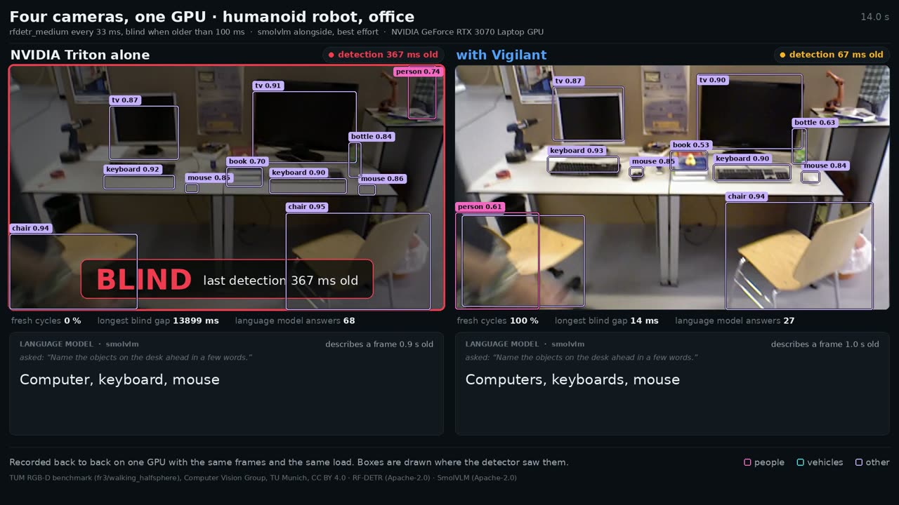
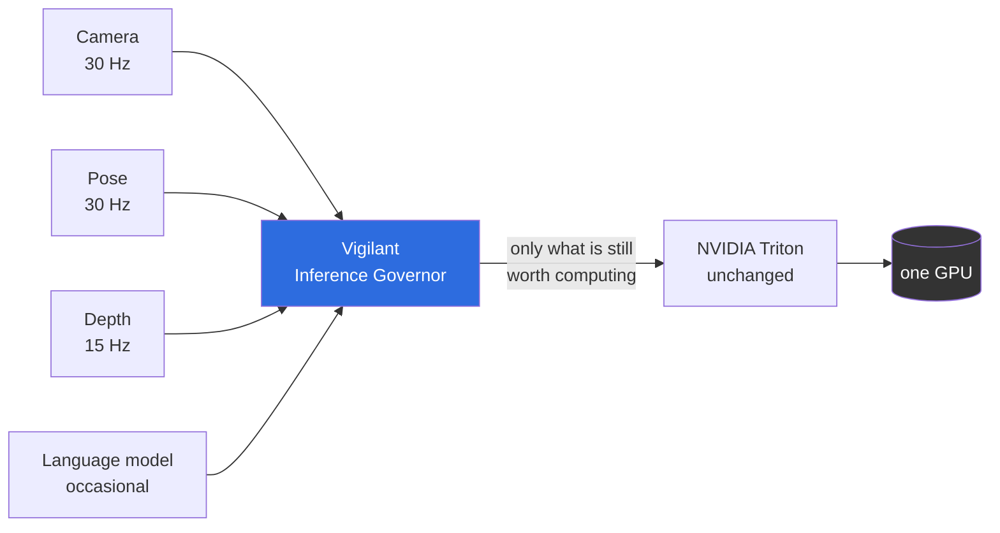
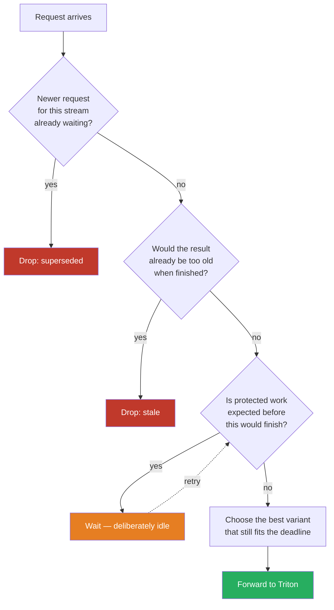

# Vigilant Inference Governor

**A scheduler for AI inference on central compute: when vision, planning and
language models share one chip on a robot or a vehicle, it keeps the results
that matter fresh.** It sits in front of your inference server — NVIDIA Triton
or TensorFlow Lite — and decides before every dispatch whether a result will
still be useful when it is finished.

**`vig autotune` tunes it for your hardware:** it measures your models on your
machine, tries the governor's settings against your contracts, and keeps only
what holds up in a back-to-back rerun — and says plainly when your load does
not need a governor at all.

> **Stop computing the past.** A faster GPU computes stale frames faster. The
> governor stops computing them.

**Why now:** robots and vehicles are consolidating their software onto a few
central computers. Perception, planning and language models increasingly share
one accelerator — and that is exactly where first-come-first-served scheduling
starts computing answers nobody can use any more.

**What it does:** drops frames that a newer one has replaced · refuses work
that would finish too late · holds back long jobs while protected work is due
· switches to a smaller model variant when time runs short. Your models stay
where they are; your client changes one line, the address.

**Measured:** against a tuned Triton on the same GPU, the detector answers in
time in **99 %** of control cycles instead of 85 % — twenty times fewer
misses. On two phones carrying a delivery-robot load, it cuts the detector's
missed cycles where the phone loses them — **293 ‰ → 99 ‰** on a Pixel 2,
**497 ‰ → 208 ‰** on a Pixel 5 — paid for by the lower-priority streams, and
not at every load point ([use cases](docs/use-cases.md)). With four cameras
and a vision-language model on one laptop GPU — a vehicle, a sidewalk robot and
a humanoid — the protected camera stays fresh in **100 %** of cycles
instead of **0.1–0.2 %**, while the language model keeps answering from a
guaranteed runtime budget ([demos](docs/benchmark/demo-2026-09-15.md)). Tested on an NVIDIA GPU and on the
Adreno GPUs of two Android devices.

**Find out whether it is for you:**

```bash
vig autotune --endpoint 127.0.0.1:8001 -c vig.yaml -o qualification
```

Where your contracts come from — freshness from motion, class from consequence
— and the loads we measured: [use cases](docs/use-cases.md).

[](https://vigilant-crs.github.io/Inference-Governor-QoS/#video)

**See it on camera** — four cameras and a language model on one laptop GPU,
NVIDIA Triton alone on the left, with Vigilant on the right (click to play on
the project page):

| Vehicle, city driving | Sidewalk robot | Humanoid robot |
|---|---|---|
| [](https://vigilant-crs.github.io/Inference-Governor-QoS/#demo-vehicle) | [](https://vigilant-crs.github.io/Inference-Governor-QoS/#demo-sidewalk) | [](https://vigilant-crs.github.io/Inference-Governor-QoS/#demo-humanoid) |
| front camera fresh **0.2 % → 100 %** | front camera fresh **0.2 % → 100 %** | head camera fresh **0.1 % → 100 %** |

[](#status-what-works-and-what-does-not)
[](#build-and-verify)
[](LICENSE)

---

## The problem, in one picture

A robot's camera produces a frame every 33 ms. The detector needs 15 ms. That
fits — until a language model starts a 95 ms job on the same GPU.

```
Time  →   0ms      33ms     66ms     99ms     132ms
          │        │        │        │        │
camera    ▼        ▼        ▼        ▼        ▼        four frames captured
          F1       F2       F3       F4       F5

a generic inference server, first-come-first-served:
          [───────── language model, 95 ms ─────────][F1][F2][F3][F4]
                                                      ▲
                                                      └── F1 is now 95 ms old.
                                                          F2, F3 and F4 are
                                                          computed anyway —
                                                          and thrown away by
                                                          the robot, because
                                                          F5 already exists.

with the governor:
          [LM quantum][F2][LM][F3][LM][F4][LM][F5]
                       ▲                       ▲
                       │                       └── every frame is fresh
                       └── F1 was dropped before it cost any GPU time:
                           by the time a slot was free, F2 already existed.
```

The server was never *wrong*. It was efficient at work that had gone stale —
it just had no way to know that.

## What it actually does

Four decisions, all made **before** the request reaches the GPU:

| | Decision | Why it matters |
|---|---|---|
| 🗑️ | **Drop superseded work.** A newer frame from the same camera replaces an older waiting one. | The old frame's result would be discarded by the robot anyway. Computing it costs GPU time that the new frame needs. |
| ⏱️ | **Refuse work that would arrive too late.** If the result would be stale when finished, it is not started. | A late answer is not a slow answer — it is a wrong one. Better to say so immediately. |
| 🛡️ | **Hold back background work.** If a protected stream is expected within the next few milliseconds, a long job does not start. | This is the one place the governor deliberately leaves the GPU idle. It is also the reason the camera stays fresh. |
| 🎚️ | **Pick the model variant that still fits.** Under pressure a smaller, faster variant is chosen instead of missing the deadline. | A slightly less precise answer on time beats a perfect answer nobody can use. |

It speaks the **Open Inference Protocol**, the same gRPC API Triton speaks. A
client changes one thing: the address it connects to.



## Measured, on one real machine

RTX 3070 Laptop (8 GB), Triton 2.70, real models — RF-DETR at 512 px, ResNet
pose and depth, a 95 ms non-interruptible block. Against a **tuned** Triton,
not a strawman: same models, same instance groups, same shared-memory data
path, rate limiter with priorities enabled.

*Coverage = share of control cycles in which a result was available whose age
was below the configured limit. Higher is better.*

| Stream | Triton (tuned) | Vigilant | Uncovered cycles |
|---|---:|---:|---:|
| detector (RF-DETR) | 84–85 % | **99 %** | **20–22× fewer** |
| pose | 91 % | **99 %** | **10–12× fewer** |
| depth | 97–98 % | 90–100 % | no gain — scatters around zero |

Six runs on two driver versions (580.173.02 and 580.178.04), three each
([R03](docs/benchmark/gate-m3-r03.md), [R04](docs/benchmark/gate-m3-r04.md)).
The depth stream has the longest period of the three and suffers least under
load; there is nothing to win there, and we do not count it as a win.

Against Triton's *strongest* setting — a globally limited shared resource
instead of priorities alone — the detector figure is **12.9–15.1×**, because
that configuration lifts Triton's own detector coverage to 89–91 %. We quote
the range rather than the best number: which one applies depends on how Triton
is configured, and you will find both in the raw logs anyway. That comparison
was measured before the gap-accounting correction of 10 September and has not
been repeated since.

That configuration moves the problem rather than solving it: the detector
rises, but pose drops to 78 %. Triton's rate limiter can reorder who waits; it
cannot know whether waiting is still worth it.

**And the honest other half:** in that same run the background language model
gets **0 % coverage**. A 95 ms block that cannot be interrupted does not fit
next to a 33 ms period — with or without a governor. The difference is that
the governor decides *which* side loses, and says so.

For models that *can* be split, that changes:

| Mode | Detector coverage | Language model progress |
|---|---:|---:|
| Governor, no decomposition | 98 % | 2 generations |
| Governor, cooperative quanta | 91 % | **40 generations** |

Twenty times more background progress for seven points of detector coverage —
a visible, tunable trade instead of total starvation.

### Measured again on 11–12 September, with corrected tooling

Two things forced a re-measurement. The benchmark tools themselves bound their
in-process gateway without `TCP_NODELAY`, which produced occasional 40 ms tails
on the governor's side; and an external review found eight defects, all fixed.
Everything below was then re-run on a quiet machine, with a watchdog that logs
every foreign process above 30 % CPU and marks a block as contaminated.

| Finding | Before | After |
|---|---|---|
| **Exactly at 100 % load** the governor dropped a lower-priority stream where Triton dropped nothing | 188 ‰ | **17 ‰** with `pipelining_depth: 1`, 4 ‰ together with the supply guard |
| **Variant selection** missed cycles at 90–125 % load | up to 143 ‰ | **0 ‰** at every load point |
| **Load bursts** looked like a loss | −3.7× | **no disadvantage** — the old number was the window view; from the consumer's side neither arm misses anything |
| **Preemption** (XSched, two Triton processes) | untested | tuned Triton alone keeps all four streams at 100 %; the governor with a preemptible lane **draws level** — fresher detector answers, slightly older background |

The cause of the first line is worth stating plainly: without pipelining the
governor waited for each answer before sending the next request and left the
GPU idle in between, while Triton had up to eight in flight. That was our bug,
not a property of the approach.

**And the price of preemption, which our earlier tables never showed:** the
XSched shim itself slows the *protected* path by 17–20 % (detector p50 27.7 →
32.5 ms). Preemption is not free, and it is paid where it hurts.

**A second GPU, a second backend.** The same governor, without a single changed
line, now runs in front of TFLite on the Adreno 540 of a Pixel 2
([ADR-0039](docs/adr/0039-a-second-backend-proves-the-seam.md),
[measurement](docs/benchmark/android-gpu.md)). The logic travels; the advantage
does not. Where two thirds of a runtime are transport and CPU rather than GPU
time, the backend's own overlapping beats our serialising — and one slot is the
wrong description of that backend. Slot count is not tuning; it is a statement
about the backend.

Full reports: [11 September](docs/benchmark/messkette-2026-09-11.md),
[12 September](docs/benchmark/messkette-2026-09-12.md),
[acceptance](docs/benchmark/abnahme-2026-09-12.md),
[pilot with preemption](docs/benchmark/pilot-praemption-2026-09-12.md).

<details>
<summary><b>What these numbers do not show</b> (click)</summary>

- **One GPU, one operating point.** An RTX 3070 Laptop is neither a Jetson nor
  a datacenter accelerator.
- **No Holoscan comparison.** Its async-buffer semantics are the closest
  competitor for the freshness question.
- **Quality is declared, not verified.** The variant-selection frontier is
  configured by the operator; we do not measure model accuracy.
- Full method, raw output and discarded runs: [`docs/benchmark/`](docs/benchmark/).

</details>

## When this helps — and when it does not

The benchmarks answer this with numbers, and the answer is not always "yes":

| Your situation | What we recommend |
|---|---|
| GPU below saturation | **No governor.** Triton is fine there; we cost 0.8 % of control cycles. |
| One stream, above saturation | **Fifty lines in your client.** Keep only the newest frame. That gets most of the benefit. |
| Several streams of different importance, above saturation | **A governor.** 47× better than the client-side do-it-yourself version, 12–28× better than tuned Triton. |
| GPU saturated exactly (95–105 %) | **A governor with `pipelining_depth: 1`.** Without it we are too cautious and drop work Triton would still have served. |
| Bottleneck is transport or CPU, not GPU time (a phone, a small SoC) | **No governor.** The backend overlaps its own work better than we can serialise it — measured, [on an Adreno 540](docs/benchmark/android-gpu.md). |

The break-even is between 100 % and 110 % offered load
([`load-ramp.md`](docs/benchmark/load-ramp.md)).

## Documentation

| | |
|---|---|
| [**Getting started**](docs/getting-started.md) | configure, calibrate, run, and read the metrics |
| [**How it works**](docs/how-it-works.md) | the four decision stages, time handling, slots, decomposition, failure behaviour |
| [**Runbook**](docs/runbook.md) | what to do when something is wrong — every symptom the system reports about itself |
| [**Security**](docs/security.md) | threat model, what is checked, the deployment checklist, accepted residual risks |
| [**Support matrix**](docs/support-matrix.md) | what is qualified, what is built but unmeasured, what is not supported |
| [**Hardware qualification**](docs/hardware-qualification.md) | what is portable, what is untested, and what to run before trusting a new platform |
| [**Releases and upgrades**](docs/releases.md) | signed artifacts, how to verify them, versioning and the upgrade path |
| [Variant example](examples/rfdetr_variants/) | four real RF-DETR models, and why the governor refuses to swap between them |
| [Benchmarks](docs/benchmark/) | every measurement, method and raw output — including the runs that were wrong *(German)* |
| [Architecture decisions](docs/adr/) | where the implementation deviates from the specification, and why *(German)* |
| [Specification](Vigilant_Inference_Governor_Specification_v1.0.md) | the full product specification v1.0 *(German)* |

## Quick start

Start it, and in half an hour it has measured your machine and tells you what
it can carry. And if it turns out you do not need us, it says that too.

```bash
# Qualify your own hardware. Writes a draft config, measures runtimes,
# concurrency and interference, asks whether the governor is worth it here,
# and checks the result.
vig autotune --endpoint 127.0.0.1:8001 -c vig.yaml -o qualification

# Then run the governor in front of Triton, on the frozen configuration.
vig serve -c qualification/measured.yaml --listen 127.0.0.1:9001
```

`vig-fit`, which answers "is it worth it here?", ships next to `vig` in the
release archive and the container image; `vig autotune` finds it there.

**Does it find what a human finds?** On a Pixel 2 we compared it against the
configuration we had tuned by hand. It now arrives at the same structure: the
same serialised model pair, the same two interference entries (within 6.4 %),
solo profiles within 3.5 % — twelve of twelve series, not contaminated, and a
clear answer for that test load (slow contracts, about 35 % planned
utilisation): *no governor needed there* — saying so is part of the job. One occupancy level
of the detector differs, in the cautious direction. On a second device, a
Pixel 5 with a different SoC and no hand-tuned reference, it derived the same
structure with that phone's own, slower numbers — again twelve of twelve
series, clean ([comparison](docs/benchmark/validierung-autotune.md)).

It leaves behind `qualification/measured.yaml` and a report in Markdown and
JSON: what was measured, under what conditions, what was discarded and why,
and what explicitly does not hold. **It never issues a qualification** — a
discarded measurement series stays discarded, a run under foreign load is
marked as such, and "the governor brings you nothing here" is one of its
normal answers ([ADR-0044](docs/adr/0044-qualification-happens-at-the-users-site.md)).

The individual steps are still there for anyone who wants them:

```bash
vig init --endpoint 127.0.0.1:8001 --out vig.yaml   # draft from a running server
vig doctor   -c vig.yaml                            # check without starting anything
vig calibrate -c vig.yaml -o measured.yaml          # measure this machine
vig serve    -c measured.yaml --listen 127.0.0.1:9001
```

No models of your own to point it at yet? `tools/repro/run.sh` runs the whole
thing end to end on freely licensed models (Apache-2.0, digests pinned) and
measures the profiles on your machine rather than trusting ours —
[reproduce it](docs/benchmark/reproduce.md).

Your client changes one line — the endpoint. Optionally it adds parameters
that say how fresh its data is:

```python
# Before: talking to Triton directly
client = grpcclient.InferenceServerClient("triton:8001")

# After: same API, same request, different address
client = grpcclient.InferenceServerClient("governor:9001")

client.infer("detector", inputs, parameters={
    "vig_age_us":    12_000,   # this frame was captured 12 ms ago
    "vig_max_age_us": 66_000,  # useless if older than 66 ms
})
```

A minimal configuration:

```yaml
version: 1
backend:
  type: triton
  grpc_endpoint: "127.0.0.1:8001"
  slots: 1                    # how many inferences the GPU runs at once
  trust: strict               # reject anything that would bypass the governor

models:
  detector:
    class: protected          # this one must not be starved
    queue: { policy: latest, capacity: 1 }   # only the newest frame matters
    contract: { period_ms: 33, deadline_ms: 33, max_age_ms: 66 }
    variants:
      - id: rfdetr
        backend_model: rfdetr
        quality: { value: 1.0, source: measured }
        profile: { p50_us: 14916, p95_us: 17081, p99_us: 17470, samples: 120 }
```

## How it works



**The deliberate idle in the middle is the heart of it.** Every general-purpose
scheduler is work-conserving: if the GPU is free and work is waiting, it
starts. That is exactly what makes a 95 ms job block a 33 ms camera. The
governor looks ahead one period, and when it sees protected work coming, it
waits — but only when waiting actually rescues something.

**Time is measured from capture, not from arrival.** A frame that spent 25 ms
in the network does not get a fresh 30 ms budget. This is why the client
passes `vig_age_us`.

**Runtimes are measured, never guessed.** `vig calibrate` measures how long
each model takes alone, how much two models slow each other down, and — for
decomposable models — the fixed per-request cost. An online estimator corrects
the prediction while running.

**The scheduling core has no clock, no I/O and no payload.** It receives `now`
at every entry point. The same code runs in the simulator and in production,
so a live trace is exactly reproducible offline.

## Architecture

```
crates/vig-core/            scheduling core: pure, deterministic, no dependencies
crates/vig-gateway/         OIP gateway, actor loop, shared-memory passthrough
crates/vig-backend-triton/  Triton adapter
crates/vig-protocol-oip/    protocol types and parameter mapping
crates/vig-config/          configuration schema and validation
crates/vig-cli/             vig autotune / init / doctor / profile / calibrate / serve
crates/vig-sim/             discrete-event simulator and baselines
crates/vig-bench/           benchmark harness against real hardware

docs/benchmark/             every measurement, including the discarded runs
docs/adr/                   architecture decisions and why we deviated
```

## Status: what works and what does not

**Working and measured on real hardware:** the scheduling core, the gateway,
the Triton adapter, shared-memory passthrough, the online estimator,
calibration, cooperative decomposition for generative models, Prometheus
metrics, graceful shutdown, and an eight-hour soak run (9–10 September) with
no metric drift and no unbounded memory growth in the observed window — which
is not the same as proving there is no leak ([soak.md](docs/benchmark/soak.md)).

Every feature carries one of four states — built, reachable, connected,
qualified — in the [support matrix](docs/support-matrix.md). "Reachable"
means a documented step switches it on and a test proves it changes a
decision; it does **not** mean it is better on your workload.

**Not done yet — this is not production-ready:**

| Open | Why it matters |
|---|---|
| Hardware beyond one machine | Every performance number here comes from one RTX 3070 Laptop. The scheduling core is built and tested for `aarch64` in CI, but **no Jetson measurement exists** — and emulation says nothing about runtime. [What you have to run first.](docs/hardware-qualification.md) |
| A second GPU platform | The governor now drives a second backend on a second GPU (TFLite on an Adreno 540), which shows the logic is portable. It is not a Jetson qualification, and the advantage did not travel with the logic. |
| A pilot | Release qualification is complete except for what needs a named workload and a named person: the sign-off of a pilot owner. Without one, every further extension is a guess. |
| Output semantics across variants | You can declare a canonical `io_signature` per model, and any variant that does not meet it prevents startup. But identical shapes can still carry different meanings, and no tool can check that — only your declaration can. |
| Preemption | A running inference is never pulled back by the governor. XSched preemption runs under the qualified Triton on this card, and it is now **measured**: with it, tuned Triton alone keeps all four streams at 100 %, and the governor with a preemptible lane draws level ([report](docs/benchmark/messkette-2026-09-12.md)). Two caveats: the residual blocking R is **declared, not measured** — `vig calibrate` could not measure it on this power-capped laptop — and a declared-but-undelivered lane measurably hurts the protected path ([pilot](docs/benchmark/pilot-praemption-2026-09-12.md)). The vLLM backend does not even load under the shim. |
| Scope of the licence grant | The provider and contact are now stated in [IMPRINT.md](IMPRINT.md). The exact boundary of "Production Purpose" in the Additional Use Grant still deserves a lawyer's eye before the first paid deployment. |

The external review of 10 September came with eight runnable
counter-examples. All eight failed, all eight are fixed and part of the
regression suite ([ADR-0032](docs/adr/0032-four-promises-that-fell-apart-between-components.md)).

Since the review round before that these moved from open to done: an inference
timeout that releases the client but **not** the slot credit, a drain that
waits for outstanding backend calls rather than just for clients, readiness
that also reacts to transport failures, immediate refusal instead of silent
waiting when every slot is quarantined, a byte budget that counts both
payload representations, cooperative quanta that keep the client's token limit
and extra inputs, TLS/mTLS and bearer-token authentication, and signed
reproducible releases with an SBOM.

Two further external reviews followed. The one of **11 September** found eight
defects (execution proof after a backend restart, shared-memory lifetime in the
pilot and the ROS 2 bridge, invalid JSON in generative decomposition, an XSched
level that silently did nothing, a start script that reported "ready" when it
was not); all eight are fixed. The one of **14 September** found eight more;
every code defect among them is fixed — the look-ahead forecast ignored the
approved variant, variant hysteresis could veto the one switch that saves
supply, buffer lifetime across measurement arms, a late-detected backend
restart, and a situation report that named its freshest camera instead of its
oldest. The remaining three are classification, not code: a green pilot
verdict judges scheduling, not the application
([that review](docs/reviews/2026-09-14/REVIEW.md)).

A review of `vig autotune` on **15 September** found that it could never
complete on an installed machine (`vig-fit` was not shipped), always refused on
a phone (it read the run queue, not foreign CPU time), and — the reason it did
not reproduce our hand-tuned Pixel 2 configuration — recorded a queue as an
occupancy runtime. All fixed; see the [changelog](CHANGELOG.md).

**One cost you should know before deploying:** after a real backend crash, a
call that was already running when the backend died can stay quarantined until
the governor restarts, because nothing proves it ended
([ADR-0042](docs/adr/0042-an-end-is-proven-not-assumed.md)). The governor loses
that slot rather than risk reusing a buffer a dead reader might still touch.

We would rather you read that list before the benchmark table.

## Build and verify

```bash
cargo fmt --check
cargo clippy --workspace --all-targets --all-features -- -D warnings
cargo test --workspace          # 900 tests, six long-running checks ignored by design
cargo deny check licenses bans advisories sources
```

All four must be green. That is the definition of done for every change.

## What this is not

- Not a hard-real-time runtime and not a safety-certified system.
- Not a GPU preemptor. A running inference is never pulled back — which is
  precisely why superseded work is removed *before* dispatch. Preemption, if
  it comes, comes from the backend process; the governor stays free of
  `unsafe` ([ADR-0033](docs/adr/0033-native-code-lives-in-the-backend-process.md)).
- Not a replacement for Triton, Holoscan or TensorRT. It sits in front of one.
- Latest-frame semantics alone are not novel; Holoscan async buffers have
  them. The combination — freshness, deadline-aware admission, variant
  selection and protocol compatibility — is what we are building.

## License

**Business Source License 1.1.** Free for evaluation, development, research,
benchmarking, teaching and CI. Production use requires a commercial license
from Vigilant e.K. Four years after publication, each version becomes
Apache-2.0 automatically.

Concretely:

| | |
|---|---|
| Evaluate, develop, test, benchmark, teach, run in CI | free, no time limit, also inside a company |
| Run it in production on **up to 3 devices** | free — a pilot cell does not need a contract |
| Production on more than 3 devices, or shipping it in your product | needs a commercial licence |

Details and prices: **[LICENSING.md](LICENSING.md)**. Full terms:
[LICENSE](LICENSE), [NOTICE](NOTICE),
[THIRD_PARTY_NOTICES.md](THIRD_PARTY_NOTICES.md). NVIDIA Triton and the NVIDIA
container images are **not** redistributed here.

If you are unsure which side of that line you are on, ask before you deploy.
We would rather answer than argue about it afterwards.

## Who we are

**Vigilant e.K.**, owner Damir Dulovic  
Königstraße 22, 70173 Stuttgart, Germany  
Commercial register HRA 726240, Amtsgericht Stuttgart · VAT ID DE 239010954

| Subject | Contact |
|---|---|
| Commercial licence, pilots, evaluations | **info@vigilant-crs.de** · +49 711 540 464 08 |
| Security reports — please not as a public issue | **info@vigilant-crs.de**, subject `SECURITY` ([policy](SECURITY.md)) |
| Bugs and questions about the software | GitHub issues |

Full legal details: [IMPRINT.md](IMPRINT.md).
