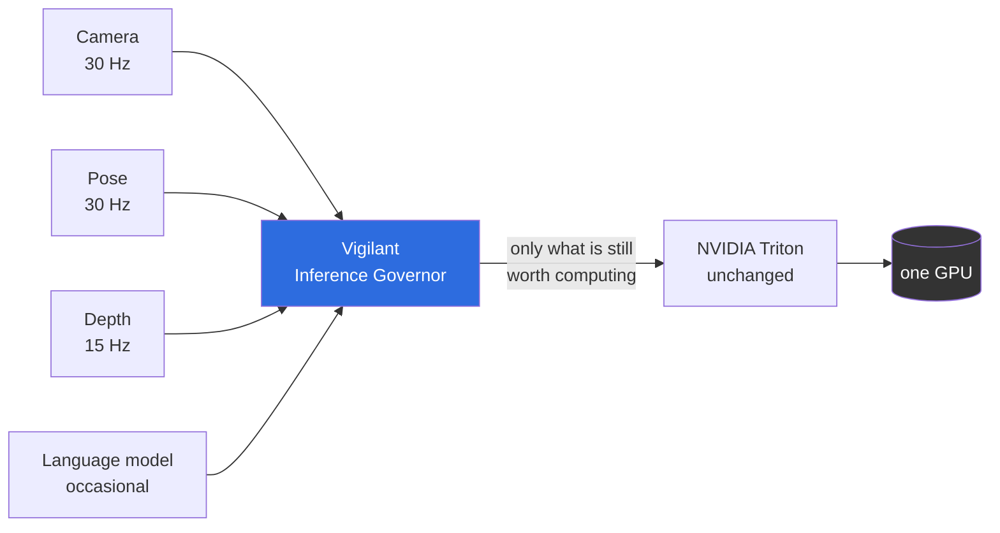
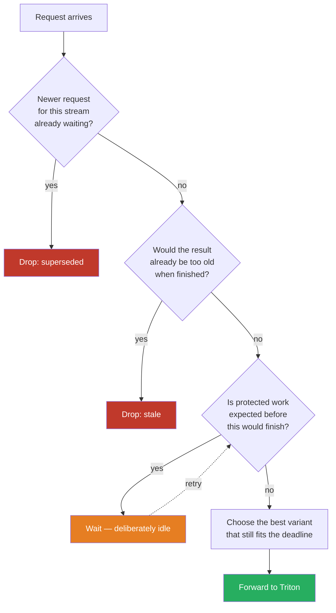

# Vigilant Inference Governor

**Inference QoS for edge robotics.** Keep your models. Keep Triton. Tell the
governor what has to be *fresh* and what merely has to be *fast* — it decides
what runs now, what waits, what is thrown away because newer data arrived, and
which model variant still fits the time budget.

[](#status-what-works-and-what-does-not)
[](#build-and-verify)
[](LICENSE)

---

## The problem, in one picture

A robot's camera produces a frame every 33 ms. The detector needs 15 ms. That
fits — until a language model starts a 95 ms job on the same GPU.

```
Time  →   0ms      33ms     66ms     99ms     132ms
          │        │        │        │        │
camera    ▼        ▼        ▼        ▼        ▼        four frames captured
          F1       F2       F3       F4       F5

a generic inference server, first-come-first-served:
          [───────── language model, 95 ms ─────────][F1][F2][F3][F4]
                                                      ▲
                                                      └── F1 is now 95 ms old.
                                                          F2, F3 and F4 are
                                                          computed anyway —
                                                          and thrown away by
                                                          the robot, because
                                                          F5 already exists.

with the governor:
          [LM quantum][F2][LM][F3][LM][F4][LM][F5]
                       ▲                       ▲
                       │                       └── every frame is fresh
                       └── F1 was dropped before it cost any GPU time:
                           by the time a slot was free, F2 already existed.
```

The server was never *wrong*. It was efficient at work that had gone stale —
it just had no way to know that.

## What it actually does

Four decisions, all made **before** the request reaches the GPU:

| | Decision | Why it matters |
|---|---|---|
| 🗑️ | **Drop superseded work.** A newer frame from the same camera replaces an older waiting one. | The old frame's result would be discarded by the robot anyway. Computing it costs GPU time that the new frame needs. |
| ⏱️ | **Refuse work that would arrive too late.** If the result would be stale when finished, it is not started. | A late answer is not a slow answer — it is a wrong one. Better to say so immediately. |
| 🛡️ | **Hold back background work.** If a protected stream is expected within the next few milliseconds, a long job does not start. | This is the one place the governor deliberately leaves the GPU idle. It is also the reason the camera stays fresh. |
| 🎚️ | **Pick the model variant that still fits.** Under pressure a smaller, faster variant is chosen instead of missing the deadline. | A slightly less precise answer on time beats a perfect answer nobody can use. |

It speaks the **Open Inference Protocol**, the same gRPC API Triton speaks. A
client changes one thing: the address it connects to.



## Measured, on one real machine

RTX 3070 Laptop (8 GB), Triton 2.70, real models — RF-DETR at 512 px, ResNet
pose and depth, a 95 ms non-interruptible block. Against a **tuned** Triton,
not a strawman: same models, same instance groups, same shared-memory data
path, rate limiter with priorities enabled.

*Coverage = share of control cycles in which a result was available whose age
was below the configured limit. Higher is better.*

| Stream | Triton (tuned) | Vigilant | Uncovered cycles |
|---|---:|---:|---:|
| detector (RF-DETR) | 84 % | **99 %** | **22.6× fewer** |
| pose | 91 % | **99 %** | **12.0× fewer** |
| depth | 97 % | **99–100 %** | **5.4× fewer** |

We also tried Triton's strongest available setting — a globally limited shared
resource, which enforces real mutual exclusion across models. It moves the
problem rather than solving it: the detector rises to 89–91 %, but pose drops
to 78 %. Triton's rate limiter can reorder who waits; it cannot know whether
waiting is still worth it.

**And the honest other half:** in that same run the background language model
gets **0 % coverage**. A 95 ms block that cannot be interrupted does not fit
next to a 33 ms period — with or without a governor. The difference is that
the governor decides *which* side loses, and says so.

For models that *can* be split, that changes:

| Mode | Detector coverage | Language model progress |
|---|---:|---:|
| Governor, no decomposition | 98 % | 2 generations |
| Governor, cooperative quanta | 91 % | **40 generations** |

Twenty times more background progress for seven points of detector coverage —
a visible, tunable trade instead of total starvation.

<details>
<summary><b>What these numbers do not show</b> (click)</summary>

- **One GPU, one operating point.** An RTX 3070 Laptop is neither a Jetson nor
  a datacenter accelerator.
- **No Holoscan comparison.** Its async-buffer semantics are the closest
  competitor for the freshness question.
- **Quality is declared, not verified.** The variant-selection frontier is
  configured by the operator; we do not measure model accuracy.
- Full method, raw output and discarded runs: [`docs/benchmark/`](docs/benchmark/).

</details>

## When this helps — and when it does not

The benchmarks answer this with numbers, and the answer is not always "yes":

| Your situation | What we recommend |
|---|---|
| GPU below saturation | **No governor.** Triton is fine there; we cost 0.8 % of control cycles. |
| One stream, above saturation | **Fifty lines in your client.** Keep only the newest frame. That gets most of the benefit. |
| Several streams of different importance, above saturation | **A governor.** 47× better than the client-side do-it-yourself version, 12–28× better than tuned Triton. |

The break-even is between 100 % and 110 % offered load
([`load-ramp.md`](docs/benchmark/load-ramp.md)).

## Documentation

| | |
|---|---|
| [**Getting started**](docs/getting-started.md) | configure, calibrate, run, and read the metrics |
| [**How it works**](docs/how-it-works.md) | the four decision stages, time handling, slots, decomposition, failure behaviour |
| [**Hardware qualification**](docs/hardware-qualification.md) | what is portable, what is untested, and what to run before trusting a new platform |
| [**Releases and upgrades**](docs/releases.md) | signed artifacts, how to verify them, versioning and the upgrade path |
| [Benchmarks](docs/benchmark/) | every measurement, method and raw output — including the runs that were wrong *(German)* |
| [Architecture decisions](docs/adr/) | where the implementation deviates from the specification, and why *(German)* |
| [Specification](Vigilant_Inference_Governor_Specification_v1.0.md) | the full product specification v1.0 *(German)* |

## Quick start

```bash
# 1. Point at your existing Triton and check that everything lines up.
vig doctor -c examples/gate_m3/vig.yaml

# 2. Measure this machine instead of guessing about it.
vig calibrate -c examples/gate_m3/vig.yaml -o measured.yaml

# 3. Run the governor in front of Triton.
vig serve -c measured.yaml --listen 127.0.0.1:9001
```

Your client changes one line — the endpoint. Optionally it adds parameters
that say how fresh its data is:

```python
# Before: talking to Triton directly
client = grpcclient.InferenceServerClient("triton:8001")

# After: same API, same request, different address
client = grpcclient.InferenceServerClient("governor:9001")

client.infer("detector", inputs, parameters={
    "vig_age_us":    12_000,   # this frame was captured 12 ms ago
    "vig_max_age_us": 66_000,  # useless if older than 66 ms
})
```

A minimal configuration:

```yaml
version: 1
backend:
  type: triton
  grpc_endpoint: "127.0.0.1:8001"
  slots: 1                    # how many inferences the GPU runs at once
  trust: strict               # reject anything that would bypass the governor

models:
  detector:
    class: protected          # this one must not be starved
    queue: { policy: latest, capacity: 1 }   # only the newest frame matters
    contract: { period_ms: 33, deadline_ms: 33, max_age_ms: 66 }
    variants:
      - id: rfdetr
        backend_model: rfdetr
        quality: { value: 1.0, source: measured }
        profile: { p50_us: 14916, p95_us: 17081, p99_us: 17470, samples: 120 }
```

## How it works



**The deliberate idle in the middle is the heart of it.** Every general-purpose
scheduler is work-conserving: if the GPU is free and work is waiting, it
starts. That is exactly what makes a 95 ms job block a 33 ms camera. The
governor looks ahead one period, and when it sees protected work coming, it
waits — but only when waiting actually rescues something.

**Time is measured from capture, not from arrival.** A frame that spent 25 ms
in the network does not get a fresh 30 ms budget. This is why the client
passes `vig_age_us`.

**Runtimes are measured, never guessed.** `vig calibrate` measures how long
each model takes alone, how much two models slow each other down, and — for
decomposable models — the fixed per-request cost. An online estimator corrects
the prediction while running.

**The scheduling core has no clock, no I/O and no payload.** It receives `now`
at every entry point. The same code runs in the simulator and in production,
so a live trace is exactly reproducible offline.

## Architecture

```
crates/vig-core/            scheduling core: pure, deterministic, no dependencies
crates/vig-gateway/         OIP gateway, actor loop, shared-memory passthrough
crates/vig-backend-triton/  Triton adapter
crates/vig-protocol-oip/    protocol types and parameter mapping
crates/vig-config/          configuration schema and validation
crates/vig-cli/             vig doctor / profile / calibrate / serve
crates/vig-sim/             discrete-event simulator and baselines
crates/vig-bench/           benchmark harness against real hardware

docs/benchmark/             every measurement, including the discarded runs
docs/adr/                   architecture decisions and why we deviated
```

## Status: what works and what does not

**Working and measured on real hardware:** the scheduling core, the gateway,
the Triton adapter, shared-memory passthrough, the online estimator,
calibration, cooperative decomposition for generative models, Prometheus
metrics, graceful shutdown, and an eight-hour soak run with no drift and no
leak.

**Not done yet — this is not production-ready:**

| Open | Why it matters |
|---|---|
| Hardware beyond one machine | Every performance number here comes from one RTX 3070 Laptop. The scheduling core is built and tested for `aarch64` in CI, but **no Jetson measurement exists** — and emulation says nothing about runtime. [What you have to run first.](docs/hardware-qualification.md) |
| Output semantics across variants | You can declare a canonical `io_signature` per model, and any variant that does not meet it prevents startup. But identical shapes can still carry different meanings, and no tool can check that — only your declaration can. |
| Field operation | Signed releases and an update path now exist. A hardware qualification programme and long-term support commitments do not. |

Since the last review round these moved from open to done: an inference
timeout that releases the client but **not** the slot credit, SIGTERM with a
drain deadline, readiness separate from liveness, a strict trust mode with byte
budgets, TLS/mTLS and bearer-token authentication, and signed reproducible
releases with an SBOM.

We would rather you read that list before the benchmark table.

## Build and verify

```bash
cargo fmt --check
cargo clippy --workspace --all-targets --all-features -- -D warnings
cargo test --workspace          # 209 tests
cargo deny check licenses bans advisories sources
```

All four must be green. That is the definition of done for every change.

## What this is not

- Not a hard-real-time runtime and not a safety-certified system.
- Not a GPU preemptor. A running inference is never pulled back — which is
  precisely why superseded work is removed *before* dispatch.
- Not a replacement for Triton, Holoscan or TensorRT. It sits in front of one.
- Latest-frame semantics alone are not novel; Holoscan async buffers have
  them. The combination — freshness, deadline-aware admission, variant
  selection and protocol compatibility — is what we are building.

## License

**Business Source License 1.1.** Free for evaluation, development, research,
benchmarking, teaching and CI. Production use requires a commercial license
from Vigilant e.K. Four years after publication, each version becomes
Apache-2.0 automatically.

See [LICENSE](LICENSE), [NOTICE](NOTICE) and
[THIRD_PARTY_NOTICES.md](THIRD_PARTY_NOTICES.md). NVIDIA Triton and the NVIDIA
container images are **not** redistributed here.

Commercial licensing and pilot enquiries: info@vigilant.example
