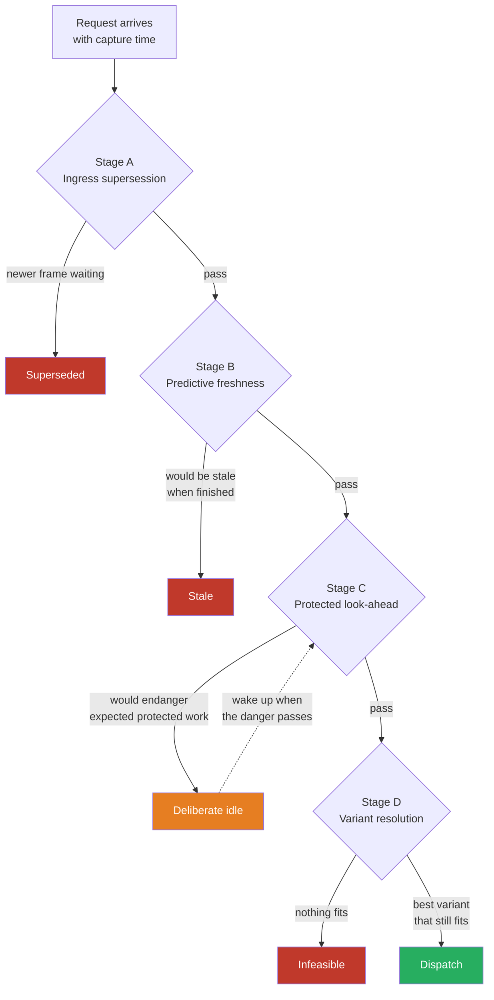
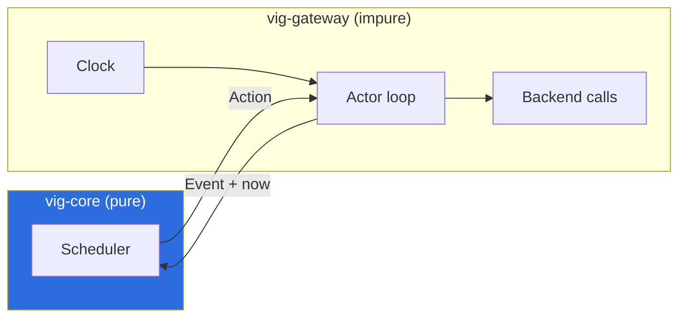

# How it works

A technical description of the Vigilant Inference Governor: what it decides,
when, and on what evidence. If you only want to run it, start with
[getting-started.md](getting-started.md).

## The premise

On a robot, part of the compute is **perishable**. A camera frame can be
obsolete before its inference even begins. A general-purpose inference server
works through its queue efficiently — but past the state of the world.

Three facts follow from that, and everything here follows from them:

1. **A result's value depends on when it arrives**, not only on whether it is
   correct.
2. **A GPU inference cannot be preempted.** Once started, it runs to
   completion. So the only place to intervene is *before* dispatch.
3. **Freshness competes with throughput.** Any system that optimises purely
   for throughput will lose freshness, and it will not notice.

## The pipeline

Every request passes four gates. Each one can end it.



**No request leaves silently.** Every removal produces an explicit terminal
state and a reason the client can read from the `vig-reason` header:
`superseded`, `stale`, `infeasible`, `cancelled`, `backend_timeout`,
`backend_failed`.

### Stage A — ingress supersession

A newer frame from the same stream replaces an older waiting one. Which frames
count as "the same stream" depends on the queue policy:

| Policy | Meaning |
|---|---|
| `latest` | One request per model. Everything else is replaced. |
| `latest_per_key` | One per key — so two cameras do not evict each other. |
| `fifo` | Order-preserving, never superseded. |
| `never_drop` | Never dropped for freshness; overflow produces backpressure. |

**Generation time decides, not arrival time.** A frame delayed by the network
does not overtake a newer one that arrived first.

### Stage B — predictive freshness

The interesting question is not "is this too old *now*" but "would the result
be worthless when it is *finished*". The governor estimates the completion
time optimistically and compares it against the configured `max_age`.

Under freshness pressure — a state the overload controller enters on measured
evidence, not on a configured threshold — this check is applied to the whole
queue rather than only to the next candidate. Work that would arrive dead is
the first thing to go.

### Stage C — the protected look-ahead

This is the one place the governor deliberately leaves the GPU idle, and the
reason the camera stays fresh.

```
                    now        expected protected arrival
                     │                    │
                     ▼                    ▼
  slot   ────────────┬────────────────────┬──────────────────────
                     │◄──── slack ───────►│
                     │                    │
  candidate needs:   ├──────── 40 ms ─────┼──────►   ✗ vetoed
  candidate needs:   ├── 12 ms ──►                   ✓ starts
```

The rule that keeps this honest: **veto only if the candidate is the cause.**
The governor computes whether the protected arrival would be feasible *without*
the candidate and *with* it. Only if the answer changes does it hold back. A
scheduler that idles without rescuing anything is worse than FIFO.

Expected arrivals are reserved **cumulatively** in arrival order: two protected
jobs can each fit on their own and miss together. The look-ahead uses the same
runtime estimate the dispatcher uses — the online observation over the offline
profile, with the learned safety margin. A guard that knows less than the
dispatcher will let through exactly the work that the dispatcher knows is
dangerous.

### Stage D — variant resolution

A logical model may have several physical variants of different quality and
speed. The governor picks the highest-quality variant that still meets the
deadline; if none does, it picks the **measured fastest** one — not the lowest
quality, because those are not the same thing.

Under overload the order inverts: the fastest feasible variant wins, as long as
it still meets the configured minimum quality. Hysteresis (`variant_dwell_ms`)
prevents flapping between variants.

Automatic selection is switched off when the variants are not interchangeable —
different input or output signatures, unknown quality provenance, or a stateful
model.

## Time

**Time is measured from capture.** A frame that spent 25 ms in the network does
not get a fresh 30 ms budget. Clients declare this with one of two parameters:

```
vig_generation_ns   an absolute monotonic timestamp
vig_age_us          "this data is N microseconds old"
```

An implausibly old value is **clamped, not reset**. Falling back to the arrival
time would turn a frame the client itself calls stale into a fresh one — which
is exactly the rule the product exists to enforce, defeated by a client bug.

The gateway's clock starts one hour ahead of process start, so that
`arrival − age` has room to represent data older than the process itself.
Without that headroom, an old frame arriving three seconds after a restart
would look brand new.

## Slots, not a queue

The backend is modelled as a set of **execution slots**, not a serial resource.
A slot holds a credit; a dispatch consumes it; a completion returns it. The
number of slots must match the backend's instance groups: set too high, a
second invisible queue forms behind the governor and reorders its decisions;
set too low, capacity goes unused.

Two models can be declared as `no_corun` — never running at the same time. The
prohibition holds until the *actual* completion is reported, not until the
predicted one elapses. A prediction does not stop a computation, and the case
where the prediction is too optimistic is precisely overload.

## Learning what the hardware does

Nothing about the hardware is guessed:

| Measured by | What |
|---|---|
| `vig profile` | how long each model takes alone (p50/p95/p99 over N runs) |
| `vig calibrate` | the same, plus how much models slow each other down, plus the fixed per-request cost of decomposable models |
| the online estimator | the observed p95 during operation, which overrides the offline profile whenever it is higher |
| the margin controller | a per-model safety factor that tightens on under-prediction and relaxes when predictions hold |

Every profile carries a **manifest** of the environment it was measured in:
which artifact (a SHA-256 digest of the model files), which runtime, which
device, how the device was partitioned, under which measurement conditions,
and up to which operating point the numbers are claimed to hold.

If the environment changes, the profile is not wrong — it is no longer
authoritative, and the governor plans more conservatively until new
measurements exist. `vig doctor` names the field that changed, not just that
something did.

Two rules keep this honest:

* **A missing field is `unknown`, never `verified`.** Silence on both sides is
  not agreement. A profile whose device was never recorded is a profile
  without a recorded device — not a passed check.
* **A contradiction invalidates; a gap does not.** A different driver version
  means the numbers were measured elsewhere. A driver version nobody wrote
  down means nobody knows. These are different states, and the governor
  reports them differently.

The artifact digest is the part that needs the model repository on disk
(`backend.model_repository`). It is the only way to see the most common silent
failure: a weight file replaced under the same version number. Nothing in the
inference protocol reveals it.

Contracts are never measured. What has to be fresh, which stream matters more,
which deadline applies — these are statements about what the robot needs, and
only the operator can make them. A system that invents its own deadlines cannot
be held to them.

## Cooperative decomposition

A generative model produces tokens one at a time, but a single request is
atomic to the GPU. A 95 ms generation cannot coexist with a 33 ms camera
period.

The governor splits such a job into a sequence of shorter requests, each sized
to the slack until the next protected arrival. Between two quanta the slot is
free and protected work passes through. State travels in the prompt: each
quantum receives the original prompt plus what has been generated so far.

The cost model is **affine, not proportional**:

```
duration = base_cost + tokens / rate
```

The base cost — round trip, backend scheduling, and re-prefill of the grown
prompt — is 14–18 ms on our measurement machine, which is the same order as the
slack itself. A purely proportional model cannot express "no quantum fits at
all", because it lets the cost go to zero with the token count. Both values are
measured by `vig calibrate`.

Each quantum re-enters admission as a full arrival. Privileged continuation
would let one started job displace protected work indefinitely — exactly what
the decomposition is meant to prevent. The original generation time is kept, so
a job that takes too long in total ages out correctly instead of running
forever.

## The data path

For large tensors the transport dominates everything else. Measured on a 6.2 MB
frame:

| Path | Overhead per request |
|---|---|
| gRPC copy | +11.7 ms (89 %) |
| shared-memory reference | **+160 µs (2 %)** |

The governor passes shared-memory references through untouched. The request
carries only where the data is, not the data — so the overhead is independent
of tensor size. Without this, a benchmark measures the transport rather than
the scheduling.

## Failure and shutdown

| Situation | Behaviour |
|---|---|
| Backend returns an error | Counted as a failure, not a completion. The margin controller is not trained on it. |
| Backend does not answer within `inference_timeout_ms` | The **client** is released; the **slot credit is not**. The GPU may still be busy, and returning the credit would schedule a second execution onto it. The credit is held until the backend actually answers. |
| The call itself is aborted mid-flight (connection dropped) | Same: the client is released with reason `execution_unknown`, the credit is held. An abort tells you nothing about whether the GPU stopped — and unlike a timeout, no answer will ever arrive. The credit is released only against **evidence** from the backend's own statistics: either the model reports at least as many completed inferences as we dispatched to it, or its counter has dropped, which only happens on a reload. A connection that never opened is different — nothing was dispatched, so the credit returns immediately. |
| Every slot quarantined | `/readyz` reports unavailable. `/healthz` stays green — restarting the governor does not restart the backend. |
| SIGTERM | New traffic stops; accepted work is answered; running inferences run to completion, up to a 20 s drain deadline. |
| Client disconnects | The request is removed from the queue. A decomposed job stops at its next quantum boundary. |

### The one assumption behind reconciliation

Releasing a held credit against Triton's completion counter is sound **as long
as this governor is the only caller of that model**. That is the documented
deployment, and `trust: strict` enforces our side of it. If another client
shares the same model, Triton counts its work too, and the counter becomes
evidence rather than proof — a foreign completion could release our credit
early.

We state this rather than hide it because the alternative is worse: without
reconciliation the only options are a blind timer, which releases the credit
on no evidence at all, or holding forever, which turns a single dropped
connection into a permanently unusable slot.

## The core has no clock

`vig-core` contains no I/O, no clock and no payload. It receives `now` at every
entry point and emits actions rather than performing them. The same code runs
in the discrete-event simulator and in production, which is why a live trace is
exactly reproducible offline — and why the scheduling logic can be tested
without a GPU.



## Where the decisions are written down

Every deviation from the specification has an ADR in [`adr/`](adr/) with the
reasoning — including why the backend is modelled as slots rather than a serial
resource, why the success metric for latest-streams must be period-based, and
why the quantum cost model had to become affine.

Every measurement, including the runs that looked plausible and were wrong, is
in [`benchmark/`](benchmark/).
