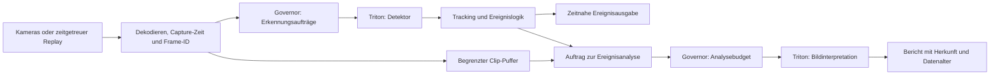

**InferenceQoS: konkrete Anwendungen, Projekte und Pilotansprache — 11.09.2026**

Empfehlung: zuerst die Entwickler von industriellen Videoplattformen ansprechen,
die mehrere Inferenzaufgaben auf einer Edge-GPU betreiben. Das Produktversprechen
sollte eine messbare Anwendungsleistung sein: aktuelle Erkennung unter Mischlast,
während zusätzliche Analyse weiterhin einen vereinbarten Mindestfortschritt macht.
Die Priorisierung der folgenden Kontakte ist meine Einschätzung aus den Quellen.

Es gibt öffentlich belegte Anwendungen und technische Anforderungen. Bei keinem
der drei Unternehmen ist damit bereits bewiesen, dass ein ungelöstes GPU-Scheduling-
Problem besteht, dass InferenceQoS es behebt oder dass eine Pilotzusage vorliegt.
Es wurde niemand kontaktiert. Projektankündigungen und Fallstudien stammen von
den beteiligten Unternehmen; sie ersetzen keine unabhängigen Betriebsmessungen.

| Reihenfolge | Technischer Ansprechpartner als Organisation | Benanntes Projekt | Stärkster öffentlich belegter Anknüpfungspunkt | Noch zu prüfen |
|---|---|---|---|---|
| 1 | Protex AI | Protex bei Bendix; zusätzlich Protex/FORT/IGX-Sicherheitsdemonstrator | Arbeitgeber beschreibt ausdrücklich die Optimierung einer DeepStream-/GStreamer-Pipeline mit strengen Latenz- und Durchsatzgrenzen | GPU-Konkurrenz, erforderliche Ergebnisfrische und eingesetzte Inferenzschnittstelle |
| 2 | Fogsphere | Vision Agent für Saipem | Echtzeit-Gefahrenerkennung; zusätzlich dokumentierte VLM-/Cosmos-Reason-Integration und ARM-/Jetson-Thor-Unterstützung | Welche Modelle tatsächlich dieselbe GPU teilen und welche Inferenz wirklich aufschiebbar ist |
| 3 | KION Group | Halos Outside-In Safety für automatisierte Lkw-Beladung | Stationäre Kameras, latenzarme Erkennung, IGX Thor; im März für 2026 angekündigter Lager-PoC | Aktueller PoC-Status, vorhandene Ressourcenisolation und akzeptabler Eingriffspunkt |

**1. Protex AI: erster Kontakt für ein Gespräch über Pipeline-Engineering.**

Die öffentlich auffindbare Stellenbeschreibung „Senior Software Engineer (C++),
Video Processing“ nennt DeepStream und GStreamer auf Edge-Hardware, einschließlich
Dekodierung, Batching, Inferenz, Tracking und Analyse. Die Aufgabe umfasst die
Optimierung dieser Pipeline unter strengen Latenz- und Durchsatzanforderungen.
Das belegt einen konkreten Engineering-Schwerpunkt. Die Ausschreibung wurde über
den Suchindex gelesen; ein direkter Seitenaufruf liefert eine JavaScript-Hülle.
Ob die Stelle noch unbesetzt ist, wurde nicht separat bestätigt.
[Stellenbeschreibung beim Arbeitgeber](https://jobs.ashbyhq.com/Protex%20AI/0bd092a6-216e-4289-9eef-a38d87395fa1).

Als benanntes Kundenprojekt beschreibt Protex die Einführung bei **Bendix Commercial
Vehicle Systems**, einschließlich Bowling Green: Videoereignisse unterstützen
Arbeitssicherheit und die Untersuchung von Störungen an einer automatisierten Zelle.
Der Fall belegt einen tatsächlichen Anwender, aber keine harte Alarmdeadline.
[Bendix-Fallstudie](https://www.protex.ai/case-studies/bendix-commercial-vehicle-systems-turns-data-into-everyday-safety-and-operational-wins-with-protex-ai).

Ein technisch konkreterer Echtzeitfall ist der von NVIDIA dokumentierte
**Protex-/FORT-Robotics-Demonstrator auf IGX Orin**: IP-Kamera → Protex-Erkennung
mit DeepStream 6.2 und TensorRT-Modell → Warnzone → sichtbare Warnung; eine weitere
Zone löst über den FORT-Sicherheitsstack einen Maschinenstopp aus. Diese Demonstration
ist ein eigenes Projekt; sie ist kein Nachweis dieser Architektur bei Bendix.
[Technische Darstellung von NVIDIA](https://developer.nvidia.com/blog/using-the-power-of-ai-to-make-factories-safer/).

Unser Pilotvorschlag: einen bestehenden Detektor mit unverändertem Tracking gegen
zusätzliche, nachrangige Klassifikation oder Ereignisanalyse laufen lassen.
Zunächst aufgezeichnete Szenen und Warnereignisse auswerten. Für nachträgliches
Coaching allein sind Millisekunden möglicherweise irrelevant; deshalb zuerst
die tatsächlich benötigte Ergebnisfrische und das Überlastverhalten klären.

Technischer Kontakt: **Ciaran O’Mara, Mitgründer**, oder **Gearoid Moore, Head of
Engineering**, mit Bitte um Weiterleitung an das CV-/Edge-Team. Die Unternehmensseite
nennt beide sowie **info@protex.ai**. Keine persönliche Mailadresse wird abgeleitet.
[Unternehmensseite und Kontakt](https://www.protex.ai/company).

**2. Fogsphere: stärkste Nähe zu Erkennung plus aufwendiger Bildinterpretation.**

NVIDIA nennt am **16.03.2026** ausdrücklich **Fogsphere als Anbieter von Safety-AI-
Agenten für Saipem**. Die Anwendungsfälle sind Personen unter schwebenden Lasten
und austretende Kohlenwasserstoffe in Bau-, Offshore- und Bohrumgebungen. Die
Meldung beschreibt bestehende Agenten und eine zusätzliche Validierung auf
AI-RAN-Infrastruktur. Ein konkreter Anlagenstandort wird nicht genannt.
[NVIDIA-Meldung mit Saipem-Anwendungsfall](https://nvidianews.nvidia.com/news/nvidia-t-mobile-and-partners-integrate-physical-ai-applications-on-ai-ran-ready-infrastructure).

Fogsphere beschreibt **Vision Agent** mit Livevideo, VLMs, Cosmos Reason/Reason 2,
Metropolis VSS, Ereignisinterpretation und Alarm-/Berichtsabläufen.
[Fogsphere, 16.03.2026](https://fogsphere.com/fogsphere-to-deliver-real-time-perception-reasoning-and-action-at-the-edge-with-nvidia-ai-ran-and-metropolis-support/).
Am **20.04.2026** kündigt das Unternehmen zudem ARM- und **Jetson-Thor-Unterstützung**
sowie MistIQ für Training und Verfeinerung an. Daraus folgt weder, dass Saipem genau
diese Hardware einsetzt, noch dass dort Training und Alarmierung dieselbe GPU teilen.
[Fogsphere zur Hannover Messe](https://fogsphere.com/fogsphere-to-deliver-real-time-perception-reasoning-and-action-at-the-edge-with-nvidia-ai-ran-and-metropolis-support-copy/).

Unser Pilotvorschlag: Personen-/Last-/Zonenerkennung mit zeitnaher Ereignisausgabe,
parallel dazu VLM-gestützte Bewertung und Berichtserstellung auf derselben GPU.
Diese Aufteilung ist ein Vorschlag, keine veröffentlichte Fogsphere-Architektur.
Wenn die VLM-Auswertung selbst erforderlich ist, um eine Gefahr zu erkennen,
muss sie ebenfalls ein geeignetes Zeitbudget erhalten. Ein VLM ist nicht automatisch
Hintergrundarbeit. Funk- und Netzlast der AI-RAN-Plattform liegen außerhalb der
gegenwärtigen Steuerung durch InferenceQoS.

Kontakt: **Vision-Agent-/Edge-Engineering**, über **info@fogsphere.com** mit Bezug
auf den Saipem-Fall; öffentlich benannter CEO ist **Pasquale Giampa** in der
oben verlinkten März-Meldung. Ein allgemeiner Zugang für Kooperationen besteht
über die [Partnerseite](https://fogsphere.com/company/partnerships/).
Dieses Programm belegt Offenheit für Partneranfragen, keine Suche nach einem
Scheduling-Zulieferer.

**3. KION: konkretes deutsches Entwicklungsprojekt mit hohem Integrationsaufwand.**

KION beschreibt am **16.03.2026** die **automatisierte Lkw-Beladung mit Halos
Outside-In Safety**: stationäre Kameras → Erkennung/Lokalisierung von Menschen,
Objekten und Robotern → Sicherheitslogik. Genannt werden Metropolis VSS und
**IGX Thor**, eine Demonstration auf der CeMAT im Oktober 2025 sowie ein für
2026 geplanter PoC im realen Lagerbetrieb. Der Text beschreibt laufende Arbeiten
an der Zertifizierung. Eine spätere Bestätigung der Durchführung dieses PoC
wurde in der Recherche nicht gefunden.
[KION-Projektmeldung](https://www.kiongroup.com/de/Presse/Pressemitteilungen/Pressemitteilungen-Detail.html?id=1099696916&title=KION+pr%C3%A4sentiert+physische+KI+im+realen+Lagerbetrieb+bei+der+GTC+2026+in+San+Jos%C3%A9%2C+Kalifornien&type=corporate).

Die Meldung nennt außerdem den bereits eingesetzten autonomen Stapler bei
**GXO Logistics in Épinoy, Frankreich**. Das ist ein separates Projekt und
kein Nachweis, dass der Outside-In-Safety-PoC dort stattfindet.

Der passende Fachkontakt ist **Johannes Hinckeldeyn, Director of Advanced Core
Technologies**. Sein GTC-2026-Vortrag behandelt externe Kameras, latenzarme
Detektionen, virtuelle Zonen und automatisierte Beladung.
[Vortrag und Referent](https://www.nvidia.com/en-us/on-demand/session/gtc26-s81838/).
In seinem eigenen öffentlichen Beitrag lädt er zum Austausch über das Thema ein.
[Öffentlicher Beitrag mit Kontaktmöglichkeit](https://www.linkedin.com/posts/johannes-hinckeldeyn-b00b972a_extend-robot-perception-with-industrial-safety-activity-7445018144319893504-HwOj).

Unser Pilotvorschlag: Kamera-Replay im Entwicklungslabor, mit Erkennung und
zusätzlicher Szeneninterpretation unter kontrollierter Konkurrenz. Ausgewertet
werden verspätete Wahrnehmung und ihre Wirkung auf die Zonenlogik. Erst prüfen,
welche Isolation der Halos-/IGX-Aufbau bereits liefert. Der aktuelle Governor
ist für eine solche Evaluation zu qualifizieren; der Einstieg in die reale
Stoppfunktion wäre ein wesentlich größeres Entwicklungsprojekt.

**Zwei ergänzende Kontakte haben einen anderen Zweck.**

**Advantech — AIR-075 / Edge AI SDK / DeviceOn:** Die Ankündigung vom
06.01.2026 nennt explizit Triton, Metropolis, Cosmos Reason und mehrere Modelle
für eine Jetson-Thor-Plattform. Das macht das Edge-AI-Team zu einem technisch
plausiblen Kontakt für Hardwarequalifizierung und gemeinsame Demonstration.
Ein Scheduling-Problem eines benannten AIR-075-Endkunden ist damit nicht belegt.
[Produktinitiative und Technologiepartner](https://www.advantech.com/en-us/resources/news/advantech-unveils-a-new-ai-brain-platform-powered-by-nvidia-jetson-t4000-to-scale-the-next-era-of-physical-intelligence).

**UC Riverside / San Diego State — PAAM:** Das RTAS-2024-Projekt untersucht
priorisierten Zugriff auf gemeinsam genutzte Beschleuniger in ROS 2.
Hier ist die Problemklasse wissenschaftlich direkt belegt; gleichzeitig ist
PAAM eine vorhandene Lösung und ein relevanter Vergleich.
[Paper](https://arxiv.org/abs/2404.06452).
Das öffentliche [Autoware-Referenzsystem](https://github.com/rtenlab/reference-system-paam)
nennt unter anderem Jetson AGX Xavier und ROS 2 Galactic. Ansprechpartner für
eine methodische Zusammenarbeit wäre **Prof. Hyoseung Kim**, öffentlich erreichbar
über **hyoseung@ucr.edu**. Das ist ein Forschungskontakt, kein bestätigter Käufer.
[Offizielle Hochschulseite](https://intra.ece.ucr.edu/~hyoseung/).

**Die konkrete Pipeline, die wir als ersten Pilot anbieten sollten.**

Der folgende Aufbau ist unser Vorschlag. Kamerazahl, Modelle und Zeitziele werden
mit dem Partner vereinbart; die bisherigen internen 300-ms-Kriterien sind keine
veröffentlichten Anforderungen dieser Unternehmen.

Die beiden Governor-Kästen sind zwei Auftragsklassen desselben Schedulers für
dieselbe GPU. Decoder, Tracking und gegebenenfalls weitere CUDA-Arbeit müssen
mitgemessen werden; der Governor kontrolliert diese im bestehenden Projekt nicht
automatisch. Zustandsbehaftetes Tracking und zeitliche VLM-Fenster dürfen durch
das Verwerfen alter Frames nicht stillschweigend fachlich verändert werden.

Für DeepStream ist **Gst-nvinferserver im gRPC-Modus** ein dokumentierter
Anschluss an einen separaten Triton-Prozess. Das ist ein möglicher Integrationsweg
zum Governor, aber keine bereits geprüfte Kompatibilitätszusage.
[NVIDIA-Dokumentation](https://docs.nvidia.com/metropolis/deepstream/dev-guide/text/DS_plugin_gst-nvinferserver.html).
Der Adapter muss Kamera-ID und Capture-Zeit übertragen, kontrolliert mit Batches
umgehen und Ablehnungen, Fristen, Metadaten sowie Pufferlebensdauer korrekt behandeln.
Ein gemeinsam gebatchter Aufruf darf die getrennten Frischebudgets der Kameras
nicht unbemerkt zusammenwerfen. Direktes TensorRT über `nvinfer` wird vom aktuellen
Triton-Proxy nicht erfasst.

Der interne Pilot besitzt einen Textbericht mit Qwen3-0.6B aus Detektionsergebnissen.
Das ist kein bereits validierter multimodaler Cosmos-Reason-Pfad. Bildencoder,
Prefill, Videospeicher und gegebenenfalls fehlende Unterbrechbarkeit müssen auf
dem Zielbackend separat gemessen werden. Der aktuelle Stand und seine Prüfgrenzen
stehen im [technischen Review](../reviews/2026-09-11-runtime/REVIEW.md) und im
[internen Pilot](edge-pilot.md).

**Ein Pilot muss vier Entscheidungen ermöglichen.**

1. **Liegt überhaupt das passende Problem vor?** Partner liefert einen konkreten
   Pipelinegraphen, GPU-/Prozesszuordnung, Modelle, repräsentative Clips und einen
   Trace mit Capture-, Queue-, Dispatch-, Completion- und Verbrauchszeitpunkten.
   Er benennt die erforderliche Ereignisfrist und die kleinste akzeptable Leistung
   der Nebenaufgaben. Bereits ausreichende Baseline oder ein Engpass ausschließlich
   vor der Inferenz bedeuten: kein nachgewiesener Nutzen dieses Governors.
2. **Ist der Anschluss korrekt?** Nach den im Review benannten Lebensdauerfixes
   mit einem Modell und einer Kamera beginnen. Frame-ID, Bildinhalt, Antwort und
   tatsächliches Ende der Backend-Nutzung müssen zusammenpassen, auch bei Timeout
   und Neustart. Danach die konkrete DeepStream-/Triton-/Treiberkombination auf
   der Partnerhardware prüfen. Die RTX-3070-Messungen qualifizieren weder Orin
   noch Thor.
3. **Ist die Mehrleistung kausal belegt?** Unbelastete Referenz, abgestimmte native
   Pipeline und Governor mit identischen Bildern, Modellen, Ankunftszeiten und
   Ressourcen vergleichen. Native Queues, Inferenzintervalle, Batching, konkurrierende
   Modellinstanzen und Ressourcenlimits sinnvoll einstellen. Ein Vorteil gegen
   eine unnötig schlechte Ausgangskonfiguration reicht nicht.
4. **Ist das Ergebnis fachlich und wirtschaftlich nützlich?** Ereignis-Recall,
   Fehlalarme, Capture-bis-Ereignis-Latenz, längste Beobachtungslücke je Kamera,
   Track-Kontinuität und fertige Analysen pro Zeit ausweisen. Alle erzeugten
   Ereignisse und verworfenen Aufträge gehören in die Bilanz. Danach bestimmen,
   ob unter denselben Qualitätsgrenzen mehr Kameras oder zusätzliche Analyse auf
   derselben Hardware möglich sind. Ein stillgelegter Berichtspfad zählt nicht als
   erfolgreiche gemeinsame Nutzung.

Die Pipeline zur reproduzierbaren Abnahme sollte diesen Ablauf erzwingen:
**festgeschriebene Konfiguration → Hardware-/Prozessprüfung → Vorabmessung →
zeitgetreuer Replay → kontrolliertes Beenden und Entleeren → Vollständigkeitsprüfung
→ fachliche Auswertung → maschinenlesbares Abnahmeergebnis**.
Ein fehlender Messarm, fremde unkontrollierte GPU-Last oder ein abgebrochener Lauf
muss das Ergebnis als ungültig kennzeichnen. Commit, Container, Modellhash,
Treiber, GPU, Datenauswahl und Konfiguration gehören zu jedem Ergebnis.

**Konkreter Inhalt einer späteren Kontaktaufnahme.**

Protex: Bezug auf die veröffentlichte DeepStream-/GStreamer-Engineering-Aufgabe;
angeboten wird ein Vergleich von Ereignisfrische und Kamerakapazität unter
konkurrierender Analyse. Fogsphere: Bezug auf Vision Agent für Saipem; geprüft
wird der Einfluss der Bildinterpretation auf zeitkritische Wahrnehmung.
KION: Bezug auf den Outside-In-Safety-Vortrag; angeboten wird eine Evaluation
von Wahrnehmungslatenzen im Replay des Entwicklungslabors.

Die jeweils konkrete Bitte wäre ein technisches Gespräch mit dem verantwortlichen
Pipeline-Team und, bei passendem Lastfall, ein gemeinsam definierter Replay-Test.
Erst dessen Ergebnis erlaubt die Aussage „dieser Partner braucht unsere Lösung“.
Bis dahin sind es begründet priorisierte Kontakte mit benannten Projekten.
