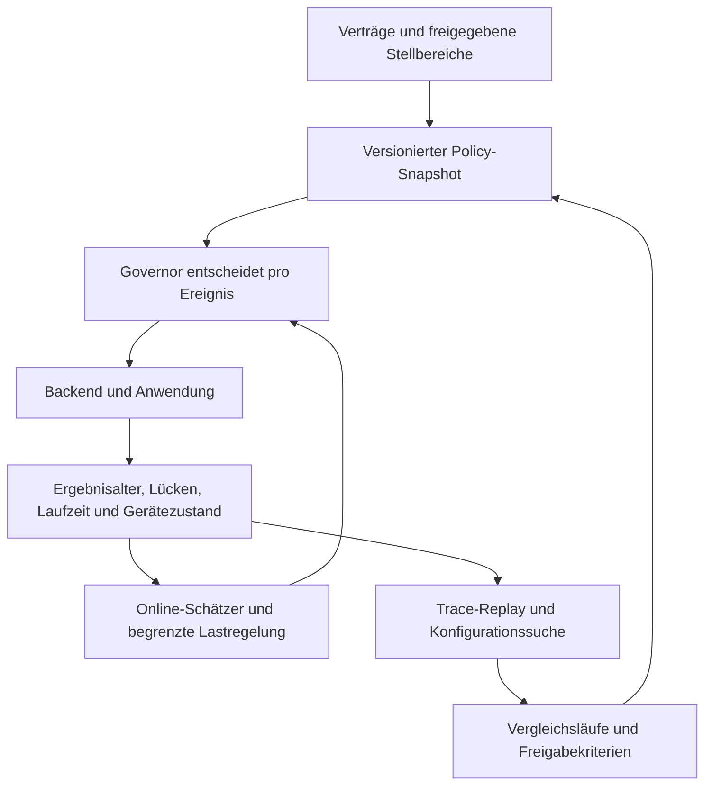

# Autotune und Governor: konkreter Ausbauplan

Stand: 15. September 2026. Entwurf, keine implementierte Funktionszusage.

## 1. Empfehlung

Vigilant sollte die **rechtzeitige Versorgung der Anwendung mit verwertbaren Ergebnissen** optimieren. GPU-Auslastung, Wartedauer und Durchsatz sind dafür Messgrößen, aber keine allein ausreichenden Ziele. Eine ausgelastete GPU kann veraltete Bilder berechnen; weniger abgeschlossene Requests können zugleich mehr rechtzeitig verfügbare Ergebnisse bedeuten.

Der nächste Ausbau braucht drei getrennte Zeitskalen: deterministisches Scheduling pro Ereignis, begrenzte Anpassung im Betrieb und langsamere, experimentelle Konfigurationssuche. Priorität haben verlässliche Messungen, ein belegter Tuninggewinn und ein echtes Vision-plus-VLM-Szenario mit Fortschritt beider Arbeitsklassen.

Die folgenden Parameter sind **Startpunkte für Experimente**. Aus dem Quellcode lässt sich keine universell optimale Lernrate ableiten. Die Freigabe muss auf den konkreten Geräten, Lastmustern und Anwendungskontrakten erfolgen.

## 2. Was bereits vorhanden ist

| Baustein | Beobachteter Stand | Grenze / nächster Schritt |
|---|---|---|
| [Autotune](../../../crates/vig-cli/src/autotune/tune.rs) | Messung, begrenzte Koordinatensuche, Bestätigung, Rücknahme; Pipeline, Versorgungsschutz, Margin Learning und Sicherheitsmarge | Wechselwirkungen und weitere Backendparameter untersuchen; reale Gewinne noch nicht bestätigt |
| [Laufzeitschätzer](../../../crates/vig-core/src/estimator.rs) | Fenster von 64 Ausführungen je Modell/Variante/Belegung; ab 16 Beobachtungen verwendbar; online p50/p95 | Kleine Fenster sind für seltene Ausreißer unzureichend; offline p99 bleibt deshalb relevant |
| [Faktorlernen](../../../crates/vig-core/src/learning.rs) | Gemeinsamer Gerätefaktor × Modellrestfaktor; Absenken nach standardmäßig 48 Beobachtungen | Schnelle Modelle dominieren gemeinsame Updates; Modellvariante und Eingabeform fehlen im Restfaktor |
| [Zustandsprädiktor](../../../crates/vig-core/src/predictor.rs) | Belegung, Takt-/Drosselzustand, Profilrevision, Shadow/Active; Absenken ab 48 Beobachtungen | Vertrauen, seltene Zustände und Übergänge brauchen stärkere Qualifizierung |
| [Ankunftsschätzer](../../../crates/vig-core/src/arrival.rs) | EWMA mit α = 1/32, mindestens 64 Intervalle | Reaktionszeit hängt von der Streamfrequenz ab; Mittelwert beschreibt weder Phase noch Jitter ausreichend |
| [Überlastregelung](../../../crates/vig-core/src/overload.rs) | 1-s-Fenster, 200-ms-Mindestverweildauer, getrennte Eintritts-/Austrittsschwellen | Schwellen auf reale Versorgungsverletzungen kalibrieren; nicht gleichzeitig mit anderen Reglern frei suchen |
| [Scheduler](../../../crates/vig-core/src/scheduler.rs) | Kritikalität, Pflichtzyklen, Deadlines, Aktualität, Varianten, Ankunftsvorschau und Ressourcenbelegung | Bessere Versorgung pro Quelle, begrenzte Vorschau über mehrere Ankünfte und qualifizierte Hintergrundreservierungen |

Im aktuellen, uncommitteten Arbeitsstand ergänzt `protected_regression()` bereits einen Vergleich je geschütztem Stream und Lastpunkt. Das schließt eine im [vorherigen Review](REVIEW.md#r03--p1--autotuning-kann-einen-geschützten-stream-deutlich-verschlechtern) gefundene Aggregationslücke konzeptionell. Die verwendete Rauschschwelle ist aber noch kein Konfidenznachweis für eine begrenzte Verschlechterung. Dieser Entwurf ist kein erneuter Testnachweis für die laufenden Codeänderungen.

## 3. Zielgröße: Bedingungen zuerst, Nutzen danach

Für jeden Stream separat erfassen:

- Anteil der **Anwendungszyklen** ohne hinreichend frisches, semantisch zulässiges Ergebnis;
- längste Versorgungslücke sowie gegebenenfalls M/K/L-Verletzungen;
- Alter des zuletzt nutzbaren Ergebnisses, gemessen vom Erfassungszeitpunkt bis zum Verbraucher;
- Deadline-Erfüllung, Ergebnisqualität und wirklich nutzbare Ergebnisrate;
- Hintergrundfortschritt, sofern als Mindestanforderung vereinbart;
- Verbindungs-/Protokollfehler und unbekannte Ausführungen getrennt von planmäßigen Ablehnungen.

Der Nenner darf nicht nur angenommene oder fertiggestellte Requests zählen. Sonst kann aggressives Verwerfen den Bericht künstlich verbessern. Bei ereignisbasierten Aufträgen zählt stattdessen jedes erwartete Ereignis, beispielsweise jedes Werkstück. Unterschiedliche Semantik braucht unterschiedliche Auswertung.

Die Auswahl einer Konfiguration erfolgt in dieser Reihenfolge:

1. Vollständige, valide Messmatrix und identische Verträge.
2. Jeder geschützte Stream erfüllt seine Vertragsgrenzen beziehungsweise die ausdrücklich festgelegte Vergleichsgrenze.
3. Vereinbarte Mindestqualität und Mindestversorgung anderer Streams bleiben erfüllt.
4. Unter den zulässigen Kandidaten: mehr nützliche Ergebnisse, geringeres Ergebnisalter und weniger Ressourcenverbrauch.

Eine optionale Nutzenfunktion kann gewichtete, normierte Nutzraten und Energie berücksichtigen. Sie darf geschützte Vertragsverletzungen nicht mit zusätzlichem Hintergrunddurchsatz verrechnen. Wenn kein Kandidat die Bedingungen erfüllt, lautet das Ergebnis „unter diesen Bedingungen nicht erfüllt“. Eine Konfiguration kann gegenüber einer schlechten Ausgangslage besser und dennoch unzureichend sein.

### Messung der Wartezeit

Mindestens `capture → ingress → governor_dispatch → backend_accept → backend_start → backend_end → consumer` unterscheiden. Nicht jeder Adapter kennt jeden Zeitpunkt; unbekannte Abschnitte ausdrücklich als unbekannt ausgeben.

Die heutige dispatch-bis-Antwort-Dauer ist kein isolierter GPU-Kernelzeitmesser. Entweder bleibt sie die konsistent profilierte Gesamtgröße, oder der Adapter liefert Teilzeiten für Warteschlange, Kopieren und Rechnen. Teilzeiten anschließend nicht noch einmal auf eine bereits vollständige Gesamtzeit addieren. Bei geräteübergreifenden Zeitstempeln Uhrensynchronisation samt Fehlergrenze berücksichtigen.

## 4. Drei Regelkreise



| Ebene | Zeitmaß | Darf verändern | Schutz |
|---|---|---|---|
| Scheduling | Jede Ankunft/jeder Abschluss | Reihenfolge, Aufnahme, zulässige Variante, Startzeit | Fester, begrenzter Entscheidungsweg und bestehende Invarianten |
| Online-Anpassung | Schätzer pro Abschluss; Stellentscheidungen zunächst alle 1–5 s | Prognosekorrektur, weiches In-flight-Limit, freigegebene Hintergrundquanten | Bekannte Bereiche, Hysterese, belastbare Abschlüsse, Rückfallprofil |
| Konfigurationssuche | Minuten bis Stunden | Gemeinsame Parameterkombinationen; qualifizierte Backendkonfigurationen | Isolierte Versuche, unabhängige Bestätigung, versionierte Aktivierung |

Deadlines, maximale Ergebnisalter, Prioritätsklassen und Mindestqualität bleiben Anwendungsverträge. Eine automatische Frequenz-/Qualitätsabsenkung ist nur innerhalb vorher freigegebener Bereiche zulässig. Eine Änderung der realen Slot-/Gerätetopologie benötigt neue Qualifizierung; ein weiches Limit darf lediglich die Nutzung vorhandener Kapazität begrenzen.

Policywechsel mit laufenden Aufträgen dürfen deren Ressourcenbilanz nicht umdeuten. Ausführungstickets und Epochen behalten; für Änderungen an Backendinstanzen oder Kapazität zuerst einen bestätigten ruhenden Zustand herstellen. Ein Timeout bestätigt kein Ende der GPU-Arbeit.

## 5. Autotune konkret erweitern

### 5.1 Gemeinsame Parametersuche

Die aktuelle Suche untersucht eine kleine Folge einzelner Änderungen. Das übersieht Fälle, in denen erst eine Kombination hilft: größere Pipeline plus andere Marge, andere Instanzzahl plus kleinere Batches oder kürzere Hintergrundquanten plus geringere Startreserve.

**Erste Ausbaustufe:** begrenzte Suche mit 2–4 gleichzeitig behaltenen Kandidaten, 2–3 Durchläufen und gezielt ausgewählten Parameterpaaren. Zunächst 16–32 Kandidaten kurz prüfen, höchstens vier ausführlicher vermessen und ein bis zwei Finalisten auf neuen Lastspuren bestätigen. Diese Zahlen sind Kostenbudgets, keine Garantie für das globale Optimum.

Sinnvolle Stellgrößen, nach Einführung der jeweiligen Fähigkeit:

| Stellgröße | Beispiel für einen Suchbereich | Voraussetzung |
|---|---|---|
| Weiche Parallelität | 1 bis qualifizierte Kapazitätsgrenze | Getrennte Behandlung von Pipeline, Ausführung und tatsächlichen Backendinstanzen |
| Laufzeitkorrektur / Lernrate | η = 0,005 / 0,01 / 0,02 / 0,05 | Ein Verantwortlicher für die Prognosekorrektur, siehe Abschnitt 6 |
| Hintergrundquantum | Wenige vermessene Zeit-/Tokenbudgets | Backend bestätigt Pause und Fortsetzung; keine angenommene Kernelpräemption |
| Batchgröße / Batchwartezeit | Unterstützte Größen, z. B. 1/2/4; Wartezeit durch verbleibende Deadline begrenzt | Modellsignatur, Speicher und früheste Deadline passen |
| Instanzzahl / CPU-Threads | Kleine Menge qualifizierter Konfigurationen | Messung von Konkurrenz, Speicherverbrauch und thermischem Dauerzustand |
| Variante / Auflösung | Ausschließlich freigegebene Varianten | Gemessene Qualität und semantisch kompatible Ergebnisse |
| Gerätezuordnung | Endliche, vorab qualifizierte Zuordnungen | Transferkosten, Datenlokalität, Domänenprofile und korrekte Messpfade |

Für Triton können Ergebnisse des Model Analyzer Kandidaten liefern. Eigene GPU-/Batchsuche vollständig nachzubauen wäre teuer. Vigilant bewertet diese Kandidaten zusätzlich anhand von Frische, Versorgungslücken und den Verträgen der Gesamtanwendung. Model Analyzer unterstützt bereits mehrere Modelle, Konfigurationssuche und Latenzbedingungen. Die genaue Unterstützung hängt vom Suchmodus ab; insbesondere die Dokumentation zum Optuna-Modus enthält Einschränkungen. [Model Analyzer](https://docs.nvidia.com/deeplearning/triton-inference-server/user-guide/docs/model_analyzer/README.html), [Suchmodi](https://docs.nvidia.com/deeplearning/triton-inference-server/user-guide/docs/model_analyzer/docs/config_search.html).

Später ist Bayes-Optimierung für teure Messungen möglich. Eine begrenzte, nachvollziehbare Suche ist zunächst leichter zu prüfen. SafeOpt liefert eine Forschungsgrundlage für eingeschränkte Exploration unter Modellannahmen; daraus folgt keine harte Sicherheitsgarantie für eine beliebige GPU-Last. [Sui et al., 2015](https://proceedings.mlr.press/v37/sui15.html).

### 5.2 Messungen gegen Zufall und Phasenabhängigkeit absichern

- Aktuelle Baseline und Kandidat mit identischer, aufgezeichneter Eingabelast vergleichen; Reihenfolge zwischen Blöcken wechseln, z. B. ABBA/BAAB.
- Mehrere Startphasen, Burstfolgen und Jittermuster verwenden. Kalten Start und thermischen Dauerzustand getrennt auswerten.
- Last während des gesamten Laufs am ausführenden Gerät messen. Die CPU des Messrechners erkennt keine fremde GPU-Last auf einem Telefon oder entfernten Server.
- Rund um die ungeklärte 90-%-Auffälligkeit gezielt dichter messen, beispielsweise 85/90/95/100 %, anschließend Zwischenpunkte an der gefundenen Grenze. Nicht nur den schönsten Punkt auswählen.
- Suchdaten und abschließende Bestätigungsdaten trennen. Simulation und Shadow-Prognosen dienen zur Vorauswahl; sie belegen nicht das Ergebnis alternativer, real nie ausgeführter Aktionen.
- Vollständige, übereinstimmende Stream-/Lastpunkt-Matrix verlangen. Fehlende Zellen sind kein bestandener Vergleich.

**Statistik:** „Die Verschlechterung ist nicht signifikant“ bedeutet nicht „die Verschlechterung ist nachweislich klein“. Pro geschütztem Stream muss die obere Konfidenzgrenze der Änderung unter der vereinbarten Toleranz liegen. Absolute Vertragsgrenzen zusätzlich prüfen. Bei mehreren Streams und wiederholten Zwischenentscheidungen Mehrfachtests beziehungsweise sequentielle Verfahren berücksichtigen; bei Burstkorrelation über hinreichend lange Zeitblöcke auswerten.

200 Zyklen sind für grobe Unterschiede hilfreich. Bei null Fehlern liegt die einseitige 95-%-Obergrenze unter unabhängigen Bernoulli-Beobachtungen ungefähr bei `3/N`: mit 200 Beobachtungen also **1,5 %**, nicht 0,1 %. Für 0,1 % braucht man schon im vereinfachten Fall ungefähr 3.000 fehlerfreie Beobachtungen; Korrelation und viele Vergleichszellen erhöhen den Aufwand. Weder 48 noch 256 Aufwärmbeobachtungen ersetzen diese Nachweise.

### 5.3 Ein wiederverwendbares Tuning-Ergebnis

Jedes Ergebnis enthält effektive Konfiguration und Verträge, Modell-/Eingabehashes, Backendversion und Image-Digest, Treiber/Delegate, Hardware- und Domänenidentität, Profilrevision, verwendete Parameter, Messspuren und Bestätigungsbericht. Gespeicherte Lernerzustände sind daran gebunden.

Nach Änderung von Modell, Treiber oder Backend gelten alte Faktoren höchstens als unbestätigter Startwert. Resume prüft Artefakte und Identität vollständig. Aktivierung, Rücknahme und Ursache werden protokolliert. Integration scheitert, kein Messnachweis, messbarer Gewinn und gültige Messung ohne Gewinn brauchen unterscheidbare Statuswerte.

## 6. Lernraten und Laufzeitprognose

### 6.1 Aktuelle Schritte richtig einordnen

Beim additiven `MarginController` beträgt der Gain 1.000 Basispunkte. Bei 1 % Zielüberschreitungen bedeutet das ungefähr **+9,9 Prozentpunkte Marge nach einer Überschreitung** und **−0,1 Prozentpunkte nach einer passenden Ausführung**.

Beim `FactorLearner` beträgt `HALF_GAIN` 50.000 ppm. Wenn Geräte- und Modellfaktor beide aktualisiert werden und keine Grenze greift, entspricht das bei 1 % Zielrate insgesamt ungefähr **+10,4 % Faktor** beziehungsweise **−0,1 % Faktor**. Der Code aktualisiert multiplikativ mit einer rationalen Exponentialnäherung. Die Warm-up-Sperre verzögert nur die Absenkung.

Das ist nicht automatisch falsch: Die starke Asymmetrie gehört zum Lernen eines hohen Quantils. Problematisch sind vor allem der große einzelne Sprung, fehlende Trennung gemeinsamer und lokaler Ursachen und unterschiedliche Anpassungsgeschwindigkeit je Streamfrequenz.

### 6.2 Vorgeschlagene Regel

Für eine positive Laufzeitkorrektur `m`:

```text
log(m_neu) = clamp(log(m_alt) + η · (I[Laufzeit > Vorhersage] − p_runtime))
```

`p_runtime` bezeichnet den erlaubten Anteil unterschätzter Laufzeiten. Er ist **nicht** der Anteil verfehlter Verbraucherzyklen. Ein rechtzeitig vorhandenes älteres Ergebnis, Warteschlangen und andere Streams verändern den Zusammenhang. M/K-Verträge daher nicht unmittelbar in dieselbe Prozentzahl für den Laufzeitlerner übersetzen.

**Versuchsstart:** Gesamtgain η = 0,02; Vergleich gegen 0,005, 0,01 und 0,05. Bei p = 0,01 ergeben sich pro lokalem Update ungefähr +2 % bei Überschreitung und −0,02 % sonst. Falls die Korrektur auf Geräte- und Modellfaktor verteilt wird, teilen sich beide diesen Gesamtgain. Vorhersage und Kalibrierung brauchen einen klaren Eigentümer; mehrere aktive Marge-/Prädiktorregler dürfen sich nicht gegenseitig kompensieren.

Diese Formel allein löst Ereignisratenabhängigkeit nicht. Gemeinsame Geräteupdates in festen Zeitfenstern sammeln und Beiträge der Modelle begrenzen. Der gemeinsame Gerätefaktor soll mehrere Modelle betreffende Verlangsamung erklären; ein einzelnes Modell korrigiert zuerst seinen lokalen Restfaktor. Steht nur ein Modell zur Verfügung, sind gemeinsame und lokale Ursache nicht zuverlässig unterscheidbar.

Absenkung versuchsweise erst nach mindestens 256 Beobachtungen **und** 30 s in einem stabilen, bekannten Zustand erlauben. Das ist eine Regel gegen zu frühe Lockerung, keine p99-Zertifizierung. Seltene Zustände behalten konservative Ausgangsprofile. Zusätzlich die Größe von Prognosefehlern erfassen: ein großer thermischer Sprung erfordert eine sofortige Rückfallentscheidung, nicht nur viele kleine Quantilschritte. Ein solcher vorübergehender Schutzaufschlag ist vom stationären Lerner zu trennen.

Die normale Lernrate kann innerhalb eines stabilen Abschnitts langsam sinken, muss aber eine Untergrenze behalten. Bei erkanntem Zustandswechsel beginnt eine neue Kalibrierphase. Eine dauerhaft gegen null gehende Lernrate würde spätere Temperatur- oder Laständerungen nicht mehr verfolgen.

### 6.3 Ankünfte und Zustände

Für EWMA-Glättung eignet sich eine Zeitkonstante statt eines festen Gains pro Ereignis:

```text
α(Δt) = 1 − exp(−Δt / τ)
```

Mit τ = 2–5 s als Versuchsbereich reagiert die Glättung zeitlich vergleichbarer. Bei 30 Hz entspricht das ungefähr α = 0,0066–0,0165; bei 370 ms ungefähr 0,071–0,169. Dies ist eine Glättungsregel, keine automatische Herleitung des Quantil-Gains oben. Für den deterministischen Kern reichen geeignete Festkomma-Näherungen oder vorberechnete Faktoren.

Pro Quelle neben Periodenschätzung auch Phase und Jittergrenzen führen. Mehrere Kameras desselben Modells dürfen nicht zu einer scheinbar schnelleren einzigen Quelle verschmelzen. Verfrühte Ankünfte brauchen eine konservative Hülle; ein Mittelwert genügt nicht.

Laufzeitkontexte schrittweise um Variante, Eingabeform/Batch, Backendzustand und relevante konkurrierende Modelle ergänzen. Sparse, hierarchische Profile vermeiden, dass jede neue Dimension eine riesige, fast unbeobachtete Tabelle erzeugt. Unbekannte Mehrfachkonkurrenz darf nicht als störungsfrei gelten.

## 7. Governor und Ressourcenregelung

### 7.1 Verbleibenden Zeitspielraum verwenden

Innerhalb der bestehenden Kritikalitäts- und Pflichtzyklusregeln:

```text
Spielraum = min(Request-Deadline, Erfassungszeit + max_age)
            − jetzt − prognostizierte Restlaufzeit
```

Bei Ketten gehören noch ausstehende Stufen in die Restlaufzeit. Ein späteres Request-Deadline-Feld macht ein bereits veraltetes Kamerabild nicht wieder nutzbar. Auswahl zusätzlich danach beurteilen, welcher Stream andernfalls als Nächstes seine zulässige Versorgungslücke überschreitet.

Zunächst die nächsten zwei oder drei relevanten Ankünfte und nur wenige Kandidaten vorausplanen. Rechenaufwand durch Knoten-/Kandidatenbudget begrenzen und die Entscheidungszeit messen. Vollständige Optimierung aller möglichen zukünftigen Aufträge wäre im heißen Pfad zu teuer und zu modellabhängig.

### 7.2 Parallelität nach Versorgung und Wartezeit regeln

Ein einfaches, kontrollierbares Versuchsverfahren:

1. Beginne bei qualifizierter Parallelität.
2. Nimmt Backendwartezeit zu und wird geschützte Versorgung schlechter, reduziere das weiche In-flight-Limit um eine Stufe.
3. Erhöhe erst nach einem stabilen Beobachtungsfenster und nur auf eine zuvor qualifizierte Stufe.
4. Halte nach Wechseln eine Mindestzeit; bewerte nicht unmittelbar Messungen, die noch von der alten Warteschlange stammen.

Mehr Parallelität kann GPU-Auslastung erhöhen und gleichzeitig alle Ergebnisse verspäten. Umgekehrt kann Serialisierung sinnvolles Kopier-/Rechen-Overlap zerstören. Der Regler braucht deshalb Ressourcenwissen und Messung; die Zahl `slots = 2` allein beweist keine zwei unabhängigen Rechenressourcen.

### 7.3 Fortschritt für Hintergrundarbeit

Ist ein Mindestfortschritt Bestandteil des Produkts, muss er als eigene Anforderung erscheinen: beispielsweise ein Budget `Q` je Zeitraum `P`, mit qualifizierter maximaler nicht unterbrechbarer Blockierzeit. Freie Zeit kann zusätzlich genutzt werden. Fairnessguthaben in vermessener Ausführungszeit führen, nicht nur in Requestanzahl.

Vor Zusage zusammen mit den geschützten Aufträgen auf Durchführbarkeit prüfen. Bei fast vollständig belegter Kapazität lässt sich kein zusätzlicher Fortschritt herbeiregeln. Dann braucht es eine zulässige kleinere Variante, kürzere unterbrechbare Arbeitspakete, einen geänderten Anwendungsvertrag oder mehr Hardware.

Für LLM/VLM: Kontext und KV-Cache zwischen Quanten erhalten; Backend bestätigt echte Haltepunkte und fortsetzbare Zustände. Ein Gateway kann einen laufenden 100-ms-GPU-Block nicht durch eine 8-ms-Einstellung rückwirkend unterbrechen.

## 8. Vier konkrete Use Cases

Die zusätzlichen Zahlen in den folgenden Beispielen sind **illustrative Lastverträge**, keine gemessenen Leistungszusagen. Anwendungslatenz muss Erfassung, Vor-/Nachverarbeitung, Transport und gegebenenfalls Aktuation enthalten. Die in der bestehenden Use-Case-Dokumentation genannten 370/740 ms und das Verhältnis Weg/Geschwindigkeit begründen für sich keine sichere Robotikfunktion.

### A. Kamera bei 30 Hz plus Vision-Language-Modell

**Vorhandener Anknüpfungspunkt:** RF-DETR mit 33-ms-Periode/66-ms-Frische neben einem ungefähr 100-ms-Block als VLM-Ersatz. Der Bericht nennt einen deutlichen Versorgungsgewinn für Vordergrundmodelle; ein echter VLM-Nachweis fehlt. [Vorhandene Messungen](../../use-cases.md).

**Optimierung:** ankunftsabhängig entscheiden, ob ein Hintergrundquantum vollständig vor dem letzten zulässigen Start des nächsten geschützten Auftrags endet. Dafür ein reales VLM mit residentem Kontext, vermessenen Prefill-/Decode-Quanten und Pausebestätigung anbinden. Nicht jeder Encoder-/Prefill-Abschnitt lässt sich beliebig klein teilen.

**Abnahme:** weniger geschützte Versorgungslücken bei gleichem Modell/Qualitätsniveau **und** nachgewiesener VLM-Fortschritt, Latenz bis zum ersten Token und Zeit zwischen Tokens. Ein Modell, das gar nicht mehr läuft, ist kein erfolgreicher Koexistenznachweis. Prüfen, ob Kontextwechsel und Speicherbedarf den Gewinn aufzehren.

### B. Vorhandene Pixel-2-/Pixel-5-Pipeline

**Ist:** Detector/Pose/Depth mit Perioden 370/185/740 ms, zwei Slots. Zero-Tensor-Tests messen zeitliche Versorgung, nicht Erkennungsqualität. Bei 90 % Last treten starke Unterschiede auf; am Pixel 5 bei 125 % verschlechtert sich der geschützte Detector laut Bericht von 3 auf 32 ‰ verfehlte Zyklen. Die Suche behielt keine der fünf Änderungen. [Messstand](../../use-cases.md).

**Optimierung:** zuerst reproduzierbare Startphasen/Jitter und geräteseitige thermische Messung; anschließend Parallelität 1/2, CPU-Vorverarbeitung und Backendwarteschlange gemeinsam untersuchen. Gemeinsame GPU-Nutzung der Delegate-Instanzen explizit modellieren. Adaptive Ankunftsprognose und konservative Profile für den heißen Dauerzustand.

**Abnahme:** denselben Lastpunkt über mehrere Phasen und Temperaturen wiederholen; jede geschützte Vergleichszelle prüfen. Auch Verluste von Pose/Depth sichtbar machen. Erst danach einen Lernratengewinn behaupten. Gute Versorgung pro Joule wäre hier ein sinnvolles zusätzliches Ziel, sofern Energie verlässlich messbar ist.

### C. Qualitätsprüfung am Förderband

**Beispiel:** alle 50 ms ein Werkstück, 80 ms Ende-zu-Ende-Budget. Benötigen feste übrige Stufen zusammen 20 ms, bleiben 60 ms für Warten und Inferenz. Die konkrete Aufteilung muss gemessen werden.

**Unterschied zur Kamera:** jedes Werkstück zählt. `latest` darf keinen noch relevanten Prüfauftrag durch das nächste Werkstück ersetzen. FIFO-/Ereignissemantik, Werkstück-ID, eindeutiges Ergebnis und explizite Fehler-/Verspätungsmeldung verwenden. Genau-einmal-Wirkung beim Verbraucher verlangt Idempotenz und Bestätigung über Wiederholungen hinweg.

**Optimierung:** Batches 1/2/4 nur testen, wenn Signatur, Speicher und die früheste Deadline passen; kurze automatische Batchfenster. Stufenketten und Restbudget einbeziehen. Qualitätsfreigabe pro Auflösung/Variante an echten Fehlerbildern.

**Abnahme:** Anteil rechtzeitig klassifizierter Werkstücke, fehlende/doppelte Zuordnungen und reale Fehlererkennung. Durchschnittliche FPS reichen nicht. Das eignet sich als klar messbarer Pilot mit wirtschaftlicher Kostenrechnung pro Linie.

### D. Mehrere Kameras auf einem Edge-Gerät

**Beispiel:** acht Quellen à 10 Hz, 200-ms-Frischeziel, zeitweise priorisierte Ereignisbereiche. Ob das passt, ergibt sich aus Modell-/Geräteprofilen und Konkurrenzmessung.

**Optimierung:** Frische und Warteschlangen je Kamera, auch wenn alle dasselbe Modell verwenden. Kurzlebige, begrenzte Prioritätshinweise; Mindestversorgung und Fairness nach Zeitverbrauch. Eine aktive Kamera darf andere vereinbarte Mindestversorgungen nicht dauerhaft verdrängen. Batching nur kompatibler Requests mit passenden Zeitbudgets. Gerätezuordnung zunächst statisch aus qualifizierten Alternativen auswählen.

**Abnahme:** Verteilung und Maximum der Versorgungslücken über alle Kameras, unter Burst, Quellenabbruch und Wiederanlauf. Als Erweiterung Szenarioprofile für geringe/hohe Kamerazahl und thermischen Dauerbetrieb liefern.

## 9. Konkurrenzlücken und Differenzierung

| Vergleich | Bereits vorhandene Stärke der Alternative | Konkrete Konsequenz für Vigilant |
|---|---|---|
| Triton / Model Analyzer | Batching, Instanzen, Mehrmodell-Konfigurationssuche und Latenzbedingungen | Backendparameter integrieren; zusätzlichen Nutzen an Verbraucherfrische, Lücken und Anwendungsverträgen belegen. [Quelle](https://docs.nvidia.com/deeplearning/triton-inference-server/user-guide/docs/model_analyzer/README.html) |
| vLLM | Chunked Prefill, Decode-Priorisierung, KV-Cache und Tokenbudgets | Einen echten Adapter bauen und Vision plus Generierung qualifizieren. Tokenbudget ist noch keine pauschale GPU-Blockierzeitgarantie. [Quelle](https://docs.vllm.ai/en/latest/configuration/optimization/) |
| Holoscan | Pipeline-/Scheduler-Infrastruktur, auch Latest-Frame-Verhalten | ROS-/Kamera-/Pipeline-Integration vereinfachen; Frische-Discard allein ist kein Alleinstellungsmerkmal. [Quelle](https://docs.nvidia.com/holoscan/sdk-user-guide/components/schedulers) |
| XSched | Präemptives Scheduling über mehrere XPU-Typen als Forschungssystem | Unterstützte Mechanismen für kürzere Blockierung nutzen und messen; Gateway-Priorisierung nicht als gleichwertige Präemption verkaufen. [Quelle](https://www.usenix.org/conference/osdi25/presentation/shen-weihang) |

Die aussichtsreiche Differenzierung ist eine **anwendungsbezogene, backendübergreifende Qualifizierung und Betriebsregelung für gemischte Edge-Inferenz**: reproduzierbar messen, zulässige Einstellungen finden, Versorgung im Betrieb beobachten, Drift erklären und kontrolliert zurückfallen. Das muss an echter Nutzlast und mindestens einem vollständigen Kundenfall sichtbar werden.

Dazu fehlen beziehungsweise benötigen Ausbau: belastbare Backendfähigkeiten und Abschlussnachweise, echte Generierungsintegration, Qualitätsmessung von Varianten, Quellen-/Pipelineintegration, nachvollziehbare Betriebsberichte und automatisierte Hardware-Regressionen. Ein großer Cluster-Scheduler würde den Fokus verbreitern, ohne diesen Nachweis zu liefern.

## 10. Umfang, Komplexität und Innovation

Reproduzierbare Zählung: [Skript](count-loc.py), [JSON mit Dateihashes](loc.json), aufgenommen am 15.09.2026, 15:39 UTC. Der Arbeitsbaum wird parallel weiterentwickelt. Gemessen werden physische Zeilen der sichtbaren `.rs`, `.py`, `.sh` unter `crates`, `backends`, `integrations`, `tools`, `deploy`, **einschließlich Tests, Kommentaren und Leerzeilen**. Dies ist keine Produktions-SLOC-Zahl.

| Umfang | Dateien | Physische Zeilen |
|---|---:|---:|
| Rust einschließlich Android-Backend | 133 | 77.377 |
| Python | 18 | 4.395 |
| Shell | 16 | 1.651 |
| **Eigenes Projekt, definierter Quellumfang** | **167** | **83.423** |
| Betriebsskripte im Runtime-Verzeichnis, separat | 29 | 2.620 |

Der Hauptworkspace umfasst neun Crates und 75.580 Rust-Zeilen. Größte Bereiche: Core 21.105, Gateway 14.109, CLI 11.304, Bench 10.763, Simulator 6.345. Der definierte Produktumfang enthält 77.559 nichtleere Zeilen; auch diese enthalten Kommentare und Tests. Dokumentation, Konfigurationen, Protobuf-Schemata, Modelle, generierter Code und die fremde XSched-Codebasis sind nicht eingerechnet. Deren Umfang als eigenen Produktcode auszugeben wäre irreführend.

**Einordnung:** mittlere Codebasis mit hoher algorithmischer und betrieblicher Schwierigkeit. Der deterministische, begrenzte Kern ist ein Vorteil. Schwieriger sind gekoppelte Ressourcen, asynchrone Abbrüche, Hardwarezustände und die statistische Beweisführung. Ein kleiner fehlerhafter Abschlusszähler kann mehr Schaden verursachen als ein suboptimaler Suchalgorithmus.

Die Laufzeitfenster kosten bei einer Beobachtung eine begrenzte Sortierung; der Scheduler prüft begrenzte Warteschlangen. Neue Kontextdimensionen erhöhen vor allem den Messbedarf. Schon 32 Modelle × 8 Varianten × 8 Belegungszustände × 6 Gerätezustände ergeben maximal 12.288 Prädiktorzellen. 48 Beobachtungen je Zelle wären theoretisch 589.824 Ausführungen; reale Konfigurationen verwenden deutlich weniger Zellen. Hierarchische Rückfälle sind deshalb wichtiger als eine vollständig ausgefüllte Tabelle.

**Innovation:** Die Kombination ist produktseitig interessant, wissenschaftliche Neuheit eines Algorithmus ist bisher nicht belegt. Prioritäten, Quantiladaption, beschränkte Optimierung, Präemption und Informationsalter sind bestehende Forschungsgebiete. [Age-of-Information-Grundlage](https://arxiv.org/abs/1608.08622), [SafeOpt](https://proceedings.mlr.press/v37/sui15.html), [XSched](https://www.usenix.org/conference/osdi25/presentation/shen-weihang).

Eine stärkere wissenschaftliche Positionierung wäre ein genau formulierter Beitrag, etwa beschränkte Online-Anpassung unter Verbraucher-Frische- und Versorgungslückenbedingungen bei unbekannter Interferenz, samt Annahmen, Algorithmus, Grenzen und Vergleichsexperimenten. Gegen abgetragenes FIFO allein reicht nicht: gut konfigurierte Backendbaselines, einfache Prioritäts-/Frischeverfahren und Einzelbeiträge der Vigilant-Funktionen vergleichen.

## 11. Umsetzung und Abnahme

Die Aufwandsspannen sind Planungsschätzungen in **Personenwochen**, abhängig von bestehender Codekenntnis und verfügbarer Hardware. Sie sind nicht durch LOC berechnet und kein Liefertermin.

| Schritt | Konkretes Ergebnis | Grober Aufwand |
|---|---|---:|
| 1. Mess- und Zustandsintegrität | Relevante Reviewfehler geschlossen und nachgeprüft; vollständige Ergebnismatrix, Artefaktidentität, Phasen-/Temperatur-Replay | 2–4 |
| 2. Autotune v2 | Gemeinsame Suche, per-Stream-Grenzen, unabhängige Bestätigung, eindeutige Ergebniszustände | 3–5 |
| 3. Online-Anpassung | Getrennte Prognose/Kalibrierung, zeitnormierte Beiträge, Drift/Rückfall und begrenzte Parallelitätsregelung | 3–5 |
| 4. Pilotqualifizierung | Ein echter Kundenfall, thermische Dauerläufe, Abbrüche/Neustarts, nachvollziehbarer Nutzenbericht | 4–6 |
| Optional parallel: echter VLM-Adapter | Kontextbewahrende Quanten, Abschluss-/Pausebestätigung, Speicher- und Fortschrittsmessung | zusätzlich 6–10 oder mehr, backendabhängig |

Damit sind die Schritte 1–4 grob **12–20 Personenwochen**. Zwei erfahrene Entwickler können einen fokussierten Stand in ungefähr drei bis fünf Kalendermonaten anstreben; Messgeräte, Pilotzugang und nicht parallelisierbare Integrationsarbeit bestimmen den tatsächlichen Termin. Breite Produktionsreife über mehrere Backends und Geräte benötigt zusätzliche Qualifizierung.

### Abnahmekriterien, bevor „selbstoptimierend“ vermarktet wird

1. Mindestens ein reproduzierbarer Vorteil gegenüber einer gut eingestellten Ausgangskonfiguration auf unabhängigen Lastspuren; kein Erfolg nur durch schlechtere erlaubte Ergebnisqualität.
2. Jede geschützte Vergleichszelle erfüllt die festgelegte Regressions-/Vertragsprüfung; fehlende Evidenz bleibt sichtbar.
3. Wenn Koexistenz verkauft wird, bleibt vereinbarter Hintergrundfortschritt messbar erhalten.
4. Erhitzung, fremde Last, Backendabbruch und Wiederanlauf führen zu erklärbarem, geprüftem Verhalten ohne erfundene freie Kapazität.
5. Derselbe Tuninglauf lässt sich anhand seiner Artefakte wiederholen; veränderte Hardware-/Softwareidentität wird erkannt.
6. Die Anwendung sieht den Nutzen: weniger Versorgungslücken, mehr rechtzeitig geprüfte Ereignisse oder geringerer Hardware-/Energiebedarf bei gleicher vereinbarter Qualität.

**Unmittelbar beginnen:** Messintegrität und den 90-%-Effekt klären, danach gemeinsame Parametersuche und einen konservativen, messbar kalibrierten Online-Regler. Das liefert die Grundlage für einen glaubwürdigen Pilot und für spätere algorithmische Differenzierung.
